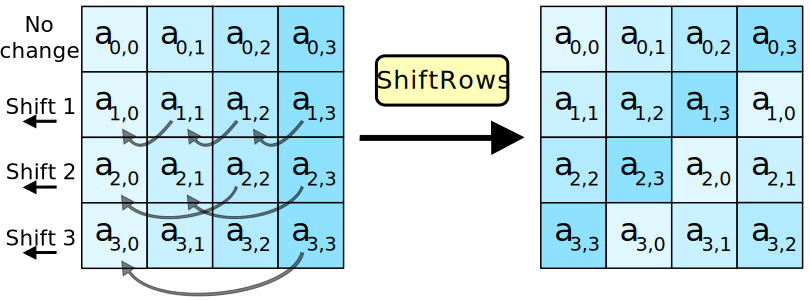

# AES, Blowfish and modes of operation

In this section we will be looking at two modern block ciphers:
* Blowfish
* Advanced Encryption Standard

We will also look at how block ciphers actually operate on a set of data, which can be referred to as its mode of operation.

## AES and Blowfish

In the 70's the National Institute of Standards and Technology (NIST) in the USA came up with a data encryption standard called DES. However, with the short key size of 56 bits, this meant that actually, it didn't stay very secure for very long. So in the mid-'90s, the NIST put out a call to anyone and everyone to come up with a better encryption standard. Both Twofish and Rijndael (AES) make the final shortlist with Rijndael winning. 

We will look at AES and an earlier incarnation of Twofish - Blowfish

### AES

AES is the encryption which is used in SSL, secure socket layer, which allows you to use the internet in a secure way.

#### Process

1. **Input Structure:**
    * We start off with out plaintext which is 128 bits long and split into a 4x4 array of bytes.
    * The array is processed column by column

    

1. **Initial XOR with Key:**
    * The plaintext is XOR’d with a key derived from the main key.
1. **Rounds:**
    * Each round (except the last) consists of the following operations involving the appropriate sub key:
        * **SubBytes:** 
            
            * SubBytes is substitution operations which take the byte in a given position and substitute it with a different value.
            * i.e. S-boxes
        * **ShiftRows:** 
            
            * shifts bytes along within a row. 
            * So the position would change. 
            * For example, we could take byte 14 and shift it along byte 2. 
            * It's cyclical, meaning that it will come back to the start and then move it in to the appropriate position.
        * **MixColumns:** 
            
            * Applies a transformation to mix bytes within columns.
            * It would take a whole column and shift that around to a different position.
        * **AddRoundKey:**
            
            * We'll recall that our key schedule allows us to derive multiple keys from our main key. 
            * And in this instance, it will take the key for that particular round, so whether that's round 1, 2, 3, 4, or 5, et cetera, you'll have the corresponding round key, 
            * and the addition can be performed at that stage.
1. **Final Round:**
    * Excludes the MixColumns step as it doesn't really add any value at this stage and is faster if it's excluded.
    * Produces the final ciphertext block after 10 rounds (for 128-bit keys).

#### Key Features and Properties

Features:
* Block Size: 128 bits.
* Key Sizes: 128, 192, or 256 bits.
* Rounds: Number of rounds depends on key size (10 for 128-bit keys).

Properties:
* Uses substitutions, permutations, and XOR operations to achieve confusion and diffusion.
* Computationally infeasible to break with current technology.

### Blowfish

Blowfish, developed by Bruce Schneier, is a symmetric block cipher that predates Twofish. Though its small block size (64 bits) limits its modern use, it remains computationally secure.

#### Process

1. Input Structure:
    * The 64-bit plaintext block is split into left and right halves (each 32-bits).
1. Key Schedule:
    * Blowfish generates 18 subkeys (P-array) and 4 S-boxes from the primary key. These keys and S-boxes are used throughout the encryption process
    * Subkeys: The P-array contains 18 keys: $P_{1}, P_{2}, \ldots , P_{18}$
    * S-boxes: Four 256-entry S-boxes are precomputed based on the key
1. Encryption Rounds:
    * Blowfish performs 16 rounds of encryption. Each round includes:
        * Apply a function $f$ to the right half ($R$) using the round key.
        * XOR the result of $f(R)$ with the left half ($L$).
        * Swap the left ($L$) and right ($R$) halves.
    * Round function $f(R)$
        
        1. Split $R$ into 4 octets (8-bit chunks).
        1. Each octet is input into one of the four S-boxes:
            * $S_{1}[R_{1}]$, $S_{2}[R_{2}]$, $S_{3}[R_{3}]$, $S_{4}[R_{4}]$
        1. Combine the S-box outputs:
            * $S_{1}$ and $S_{2}$ are combined using addition $\mod 2^{32}$
            * the output of the previous is XOR'd with $S_{3}$
            * finally, the output of the previous is added $\mod 2^{32}$ with $S_{4}$.
        1. The result is $f(R)$, which is XOR'd with $L$
    * After each round, $L$ and $R$ are swapped.
1. Final Step:
    * After 16 rounds, undo the last swap so that $L$ and $R$ are in their original order.
    * Perform XOR operations with the final two subkeys:
        * $L$ XOR’d with subkey $P_{18}$.
        * $R$ XOR’d with subkey $P_{17}$.
    * Combine the halves to produce the ciphertext block.

#### Key Features and Properties

Features:
* Block Size: 64 bits.
* Key Sizes: Up to 256 bits.
* Structure: Based on the Feistel network.
* Rounds: 16 rounds.

Properties:
* Utilizes S-boxes for substitution and modular arithmetic for transformations.
* While not as common as Twofish, it is used in some modern systems (e.g., password managers).

## Modes of Operation

Thus far, we have primarily been working on the basis of encrypting one block at a time and then move on. However, this can impact the security because you can start to recognise patterns in the data. There are a number of different types of modes of operation but we'll look at two:

### Electronic Code Book (ECB)

In ECB the process is as follows:
* the plain text is divided into fixed size blocks, say $b$ bits a piece
* each block is encrypted in isolation using the same key.
* if the message is longer than the block size, padding is applied to the last block as necessary

Note that if the length of the plain text is not a multiple of the block size, padding is added to the last block to make it a complete block.

There are some advantages and disadvatages to ECB.

***Advantages:***
* Easy to implement and conceptualise, making it attractive where ease of implementation and efficiency are desirable.
* It's resilient to the loss or corruption of individual blocks during transmission. Each ciphertext block is generated independently of other blocks, which mean that loss or corruption of one block does not leak into neighboring blocks.

***Disadvantages:***
* If the same $b$-bit block of plain text appears more than once in the message, it always produces the same ciphertext. Because of this, for lengthy messages, the ECB may not be secure. 
* If the message is highly structured it may be possible for a cryptanalyst to exploit these regularities. For example, if it is known that the message always starts out with certain predefined fields, then the cryptanalyst may have a number of known plaintext-ciphertext pairs to work with. 
* If the message has repetitive elements, with a period of repetition a multiple of $b$-bits, then these elements can be identified by the analyst.

### Cipher Block Chaining (CBC)

In CBC the process is as follows:
* the plain text is divided into fixed size blocks, say $b$ bits a piece
* the first block of plain text is XORed with an initialisation vector (a pseudo-random number generated value)
* this is then input to the encryption function to produce the first cipher text block
* the next plain text block is XORed with the previous ciphertext block and input to the encryption function to produce the next cipher text block.
* This process is then repeated for each subsequent plain text block.

---

Next: [Making Block Ciphers Usable - Message Authentication Codes](Making_Block_Ciphers_Usable-Message_Authentication_Codes.md)