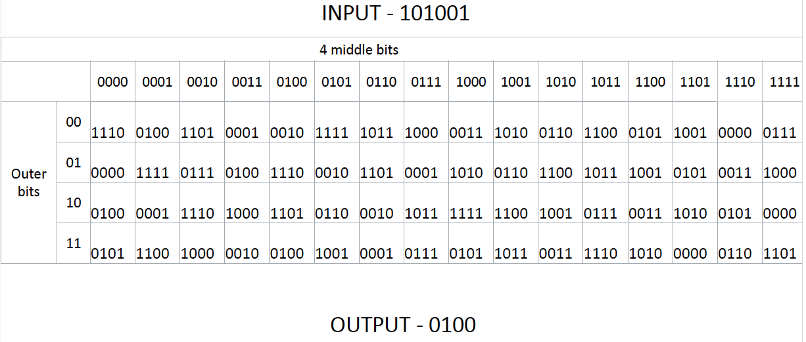
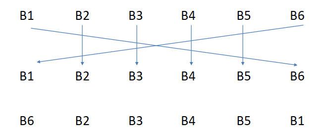
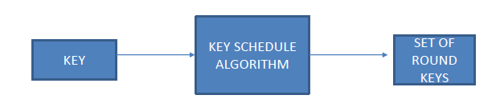

# Components of modern block ciphers

In this section we will look at three of the key components of a modern block symmetric cipher:
* substitution boxes
* permutation boxes
* key schedules

## Substitution boxes

Substitution or s-boxes effectively allows us to take a block of data and replace it with a different block of data. This can be implemented in a number of different ways. One of the common ways of doing this is through a lookup table where we are given a particular position and take the value at that position to replace the original value.

Lets look at an example. This example has been taken from the Data Encryption Standard. This was defined in the '70s by the National Institute of Standards and Technology. However, it is not suitable for modern use, but does provide a practical example that's easy for us to see how it can work.

* We take an input consisting of 6 bits: $101001$
* We take the middle $4$ bits, $0100$, to determine the column
* We take the $2$ outer bits, $11$, to determine the row
* We then find the intersection of our row and column to determine our output: $0100$.

## Permutation boxes

In a permutation or P-box, bits can be rearranged, repeated, and possibly discarded, but not changed. It could be said that this is a subclass of an S-box, but this doesn't go the other way around. That is, an S-box cannot be a P-box but a P-box could be classified as an S-box.

### Types of P-box

There are three types of P-box:
* ***Straight P-box:*** just transposes the digits, the $1$'s and $0$'s.

In this example, we take the first bit and the last bit, and reposition those so that they are swapping. So we'll take bit $1$, swap it with bit $6$, and vise versa. We'll take bit $2$, $3$, $4$, and $5$, and keep those static. This then provides the output at the bottom of our permutation box, where we can see that these have been reordered appropriately. Bits $1$ and $6$ swap places, and $2$, $3$, $4$, and $5$ remained static.
* ***Compression P-box:*** discards some of the bits

* ***Expansion P-box:*** basically takes particular elements within a block and repeats the values

### Diffusion and confusion

S-boxes and P-boxes provide two important properties of a secure cipher: confusion and diffusion. Modern cryptography attempts to achieve both of these for a secure cipher. 

* confusion: each bit of the ciphertext is dependent on multiple parts of the key. Effectively, we are obscuring the relationship between the key and the cipher. A substitution box helps us to achieve this property.
* diffusion: Diffusion, in contrast, means that if one bit of the plain text is changed, then that should impact many parts, in fact, at least half of the ciphertext bits. This is where the permutation block comes in.

It's the combination of these two aspects which help us define a secure cipher.

## Key schedules

In modern symmetric block ciphers, we often repeat a series of steps multiple times. These are referred to as rounds. Within each round a subkey is used. This can also be referred to a round key. Sub keys, or round keys, are keys which are derived from the original key, adding further complexity to the cipher. In order to determine what the round keys are, we have to define an algorithm called a ***key schedule***. This algorithm allows us to take a key which is normally at least 128 bits in length and use it to generate these round keys.

Doing this achieves a similar goal to the Vigenere cipher, which had multiple cipher alphabets. In this instance, we're generating multiple keys from the original, so as to help hide the relationship between the plaintext and the ciphertext even further. 

In the past, key schedules have been based primarily on relatively straightforward permutations and substitutions. However, in more recent cryptography, we're looking at more complex ways of generating a key schedule. However, we won't go into that in particular depth here. It's just important to recognise that a single key can be used to generate round keys.