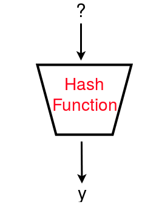
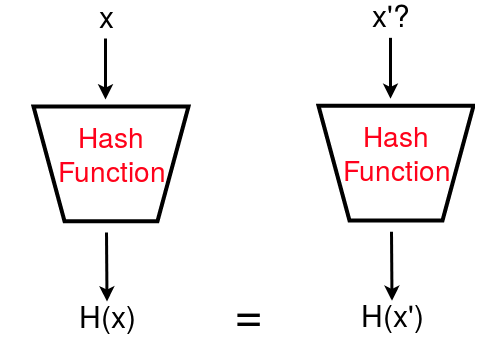
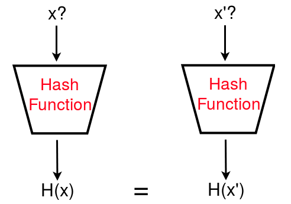

# Cryptographic Hash Functions

## Cryptographic Primitives

Before we consider what a cryptographic hash is, it is helpful to note that a cryptographic hash function can be referred to as a cryptographic primitive. A cryptographic primitive can be considered a generic building block of cryptography. Cryptographic primitives are a low level constructs which are used together to build larger cryptographic protocols.

## Cryptographic Hash Definition

A cryptographic hash function takes data of an arbitrary length, and produces a fixed length string of alphanumeric characters which represents that data. The output can be called a hash value or a digest. I primarily refer to this as a hash value, but you may come across other sources which use the term digest.

There are a number of hash function standards such as SHA-256 and MD5. Note that MD5 is considered insecure for modern practical use, but is commonly used as an example. SHA-256 is commonly used in modern practice.

If calculating the SHA-256 hash of the following string “this is an arbitrary length string” then you should get the hash value:

018D17D6672278F09D99C87B882A4D0AC00CB7322A471BFAA49C6E32C71937E0

## Secure Properties of Cryptographic Hashes

A cryptographic hash function has a number of properties, most notably the following:

* ***Deterministic:*** The same input using the same hash function always provides the same hash value. This is true for all hash functions, but the following properties are for cryptographic hashes only.
* ***Pre-image resistant:*** This means that given a random output, it is computationally infeasible to determine the input from the hash value alone. For any given code $h$, it is computationally infeasible to find $x$ such that $H(x)=h$. This effectively is a one-way function.

* ***Second pre-image resistant:*** Given a hash value $h_{1}$ it should be computationally infeasible to find a different input message which results in the same hash value $h_{1}$

* ***Collision resistant:*** It should not be feasible to produce two inputs which have the same hash value as output. It should be computationally infeasible to find any pair $(x, y)$ such that $H(x) =H(y)$.

Note the distinction between second pre-image resistance and collision resistance is that in second pre-image resistance you have a given input which it is impossible to find another value which hashes to the same output. For collision resistance, you have no such input and are simply trying to determine two inputs which produce the same hash value.

## Purpose of Cryptographic Hash Functions

You may be wondering the purpose of cryptographic hash functions. Consider an example as follows, you locate software you wish to download and install from a trusted secure website. On the website you are provided with a link to download the software and a hash value, as well as the specific hash function used to calculate that value. If you then independently calculate the hash value of the file downloaded using that function, and this matches the hash value provided on the website then you have confidence in the integrity of the file. If it were changed, e.g. by an attacker, then the hash value would not match and you would not install the software.

## Limitations

There are some limitations of cryptographic hash functions:
1. Very small messages or predictable messages cannot be meaningfully hashed. For example, a single bit cannot be meaningfully hashed as any attacker could easily compute the input to result in the hash value.
1. You must trust origin of hash function in order for it to provide integrity, e.g. on a website providing software you would need to be confident of a secure channel which provides the hash value

---

Next: [Substitution Ciphers](Week_2/My_notes/Substitution_Ciphers.md)