# Introduction to Cryptography

## Cryptography Fundamentals

### Cryptography Overview

A cipher is effectively an algorithm which allows us to send a message across an insecure network in a secure fashion. It means that if anyone were to intercept that message, they would be unable to read the contents of that message.

#### Cryptography components

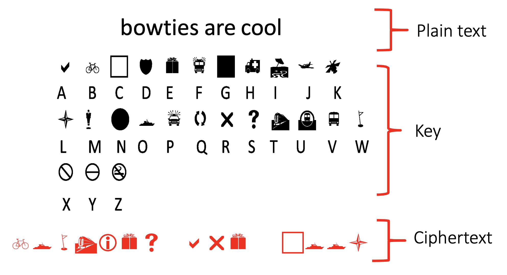

There are three components:

* **Plain text:** The unencrypted message. This is a message that if anyone were to intercept that, they would be able to read it irrespective of whether they have access to the key or not
* **Key:** The key itself is the thing that allows us to apply the encryption. It's the
secret information that allows us to encrypt and potentially decrypt that information as well.
* **Ciphertext:** The bottom line here shows the ciphertext. Ciphertext is the result of applying encryption to the plain text using the key.

The intention here is that if someone was to send a message over an insecure network, anyone intercepting that would not be able to read that message without the key.

#### Sending messages

Three of the key names that you might hear in relation to cryptography
include Alice, Bob, and Eve. 

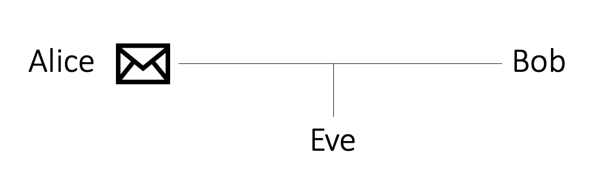

These are just traditional labels used to represent intended recipients, and the sender, as
well as someone trying to intercept that message. So Alice is sending a message, Bob is
receiving it or vice versa, and Eve is trying to intercept that message.

#### Cryptography Process

The overall process when it comes to ciphers is that we take our plaintext and we can apply our encryption algorithm using the key and that results in our ciphertext. And then we can perform the reverse, the decryption. We apply the decryption key to the ciphertext to get the plain text out.

The example that we have here, the key is basically a substitution where we're taking every letter in English alphabet and translating that into a little diagram or figure if you like. 

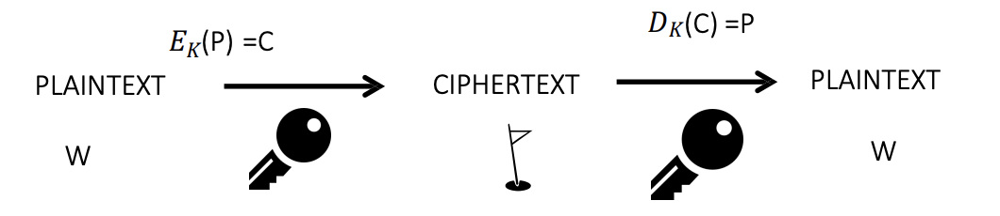

When we're looking at ciphers, there's two general classifications that you might come across:

* **Symmetric cryptography:** Within symmetric cryptography, we've got the same key for encryption as we do for decryption
* **Asymmetric cryptography:** Within asymmetric cryptography, we have a different key

### Cryptographic Hash Functions

### Substitution Ciphers

In this section we'll look at substituions and permutations through the lens of traditional cryptography.

#### Caeser cipher

Very simple cipher where each letter is shifted along the alphabet. An example using a key of 3 is shown below:

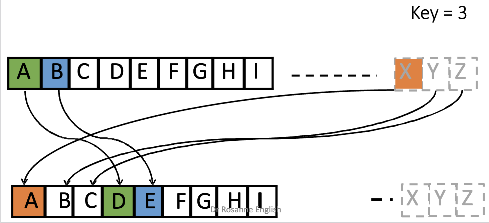

A is shifted to D, B to E, and so on until we reach X which is then sent back to A.

So as you can see, substitution is simply a case of taking a letter or component within your plain text and substituting it with a different value. In this instance, we're mapping letters to letters. But it could also relate to ones and zeros or bytes or even a longer set of bits. But we don't need to use just the one cipher alphabet. We can actually expand that and use a range of different possible cipher alphabets. 

#### Vigenere Cipher

The Vigenere cipher makes use of the Caesar cipher except with the whole range of possible
shifted values. So it starts off with a shift of 0, shift of 1, and goes further down until you get to the maximum shift of 25. Traditionally, this is done using a Vigenre cipher grid, as you can see here. 

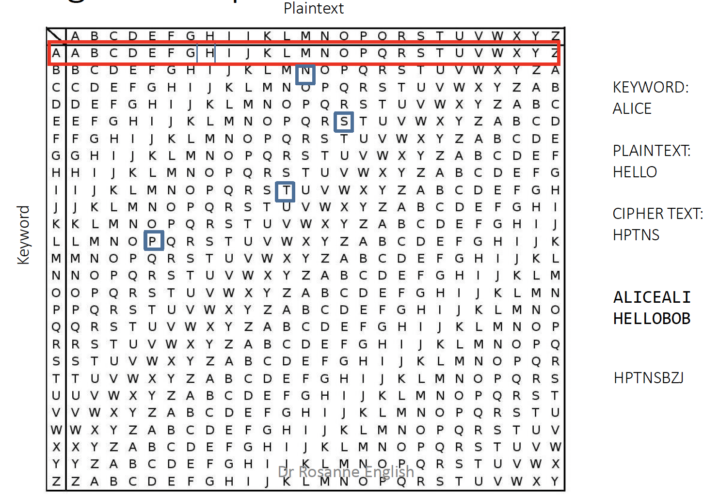

Within the Vigenre cipher, we pick a key which doesn't have any repeated letters. And we then place that key above every letter within our plaintext. Repeat that key as needed over the plaintext. And we then use that to evaluate which alphabet we should be using in order to encrypt. 

For example, say we use a keyword of ALICE and we want to encrypt the plaintext HELLO. Placing ALICE above HELLO we take the keyword value above each letter and look up our grid to get the correct ciphertext. Above H is A so we look up where row A intersect column H and we get H. Above E is L so we look up where the row L intersect the column E to obtain P. Repeating this process we finally obtain the ciphertext HPTNS.

Another way of looking at the Vigenre cipher is to translate every letter and into a position number. 

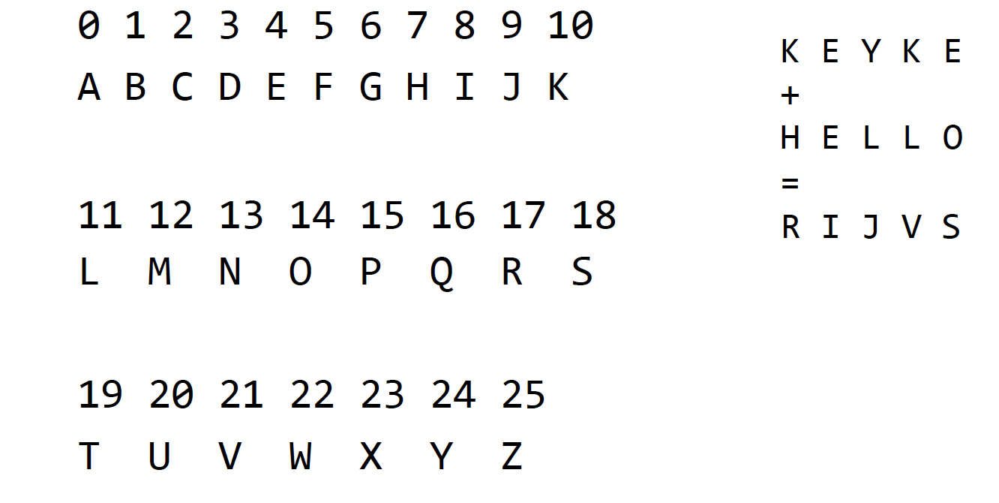

So A would be 0 through to 25. We can then translate any letter, whether that's in our plain text or whether that's in the key. And then, perform the addition for those. And the resulting value, obviously, it needs to be calculated mod 25. But the resulting output can then be translated back from a number into the corresponding letter. 

This is slightly easier if you ever want to implement this in code, for example. But often, that visual representation of the Vigenre square can be helpful in wrapping your head around what's happening. 

### Permutations

Permutations, as the name suggests, is basically moving components around.

One such example is the Rail-fence cipher. In this cipher we take every second letter and move it down to the line beneath that one. So if we look at hello world, on the top line, we end up with H, L, O, O, L. And then, the second line we've got E, L, W, R, D. 

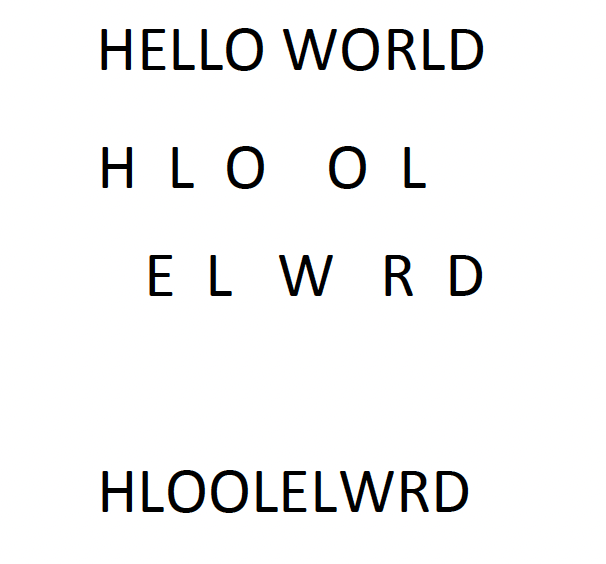

The idea then is that you put the second line after the first line. So effectively, you end up with an anagram at the bottom there.

## Modern Cryptography Structures

### Stream Ciphers

A stream cipher effectively works with a stream of data. This could be a stream of bits or a stream of bytes. 

The most simple example that I give is to work with the bitwise operations. So for example, an exclusive OR (XOR) operation. In this example, we would take each bit of the plaintext, in turn, and perform an XOR operation with the corresponding key bit. An example is as follows:

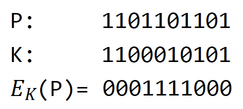

For decryption in this particular example, we would repeat the same process. Effectively, we need to XOR the ciphertext with the key which is repeated once more, and the resulting output would be the plaintext.

### Block Ciphers

In a block cipher, we take a block of data and encrypt that or decrypt that before moving on to the next block. This is in contrast to a stream cipher, where we take each bit per bit or each byte per byte. In terms of block size, typically, we're looking at 128 to 156 and so on and so forth. So we're taking a set of bits, working on that before moving on. 

There are a number of different operations which can be completed within a block cipher. A very basic example is shown below.

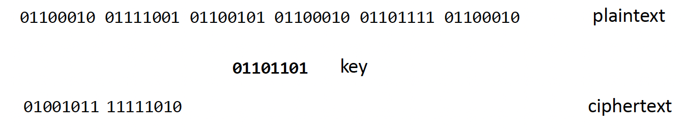

For each block of data we:
1. Split in two
1. Switch halves 
1. Do XOR with key

#### Padding

In the previous the length of the message happened to be a multiple of the key length. That's very unlikely to be the case in real world applications. To get around this we look at a primitive (fundamental operation defined withing cryptography) called padding. Padding is the process of expanding the length of a message to ensure that it's a multiple of the key. There are a range of different standards which can be used to achieve this.

A simple example standard based on the cryptographic message syntax is shown here. 

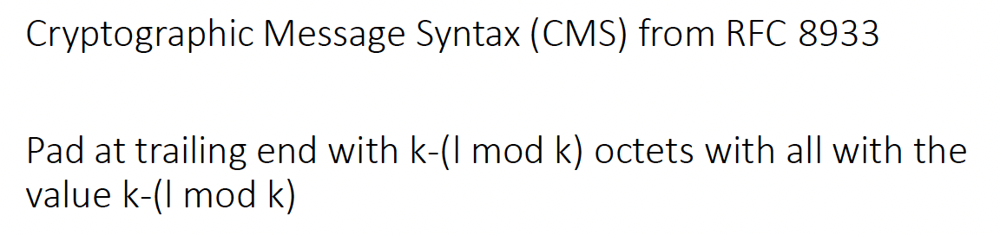

In this example, what we're doing is we're figuring out effectively what the remainder is upon division by the key size. So if we have, for example, a key size of 12 and a message of length 8, then we've got 4 bytes left over. So we need to pad that up by another 4 bytes. So what we do there is we replicate that number in bytes for four different bytes. This isn't necessarily the best example in terms of real-world use. So if you are applying this in modern use, you'd want to make sure what the context is within your workplace to identify an appropriate padding algorithm. In saying that, it is a nice, easy example to give you a flavour for what that could be.

Caveat: The above form of padding with a short message can potentially lead to a Bleichenbacher attack (LOOK UP!)

### Feistal Ciphers

The below is referred to as a Feistal structure:

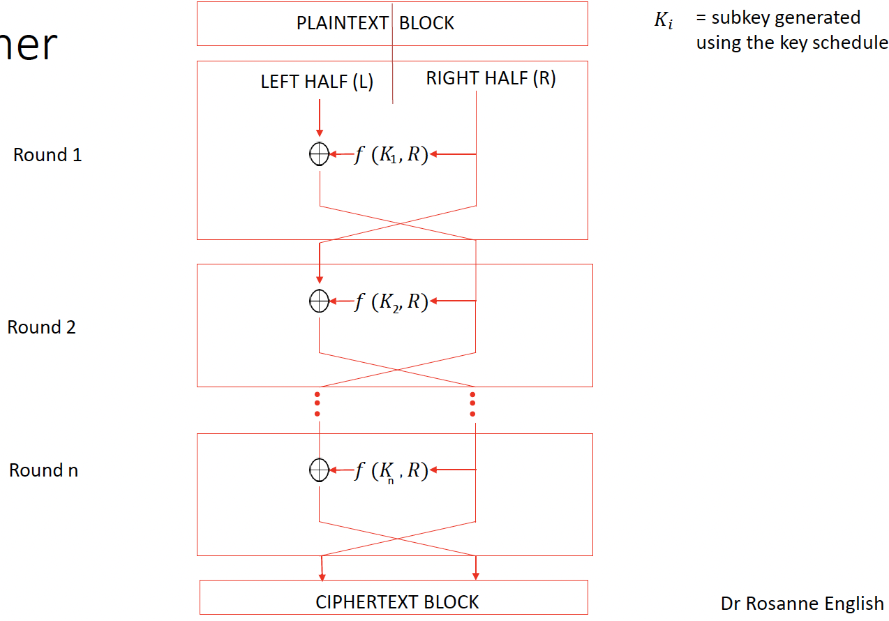

We start off with a plaintext block and split into two halves. We will assume that the two halves are even but there are Feistal structures that work with uneven halves.

TO FINISH!!!

### Components of modern block ciphers

### AES, Blowfish and modes of operation