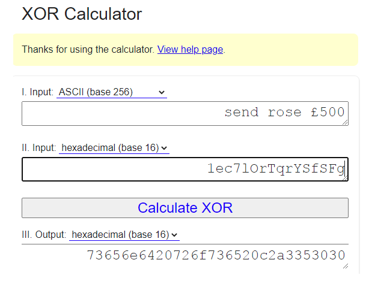
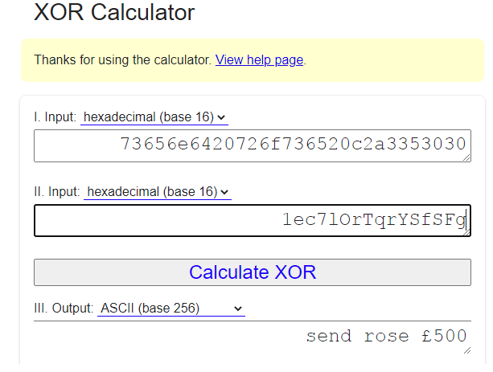
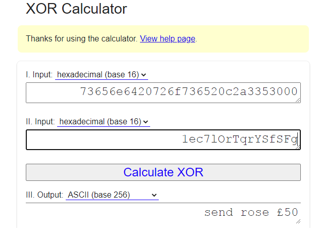

# Making Block Ciphers Usable- Message Authentication Codes

## Limitations of Ciphers and Integrity Issues

One limitation of ciphers, even when making use of block ciphers with unique initialisation vectors, is that an attacker could flip a bit (or more) of the initialisation vector or ciphertext. This is sometimes called a bit flipping attack.

This would mean that decryption would no longer be successful for block ciphers, or for stream ciphers it would alter part of the plaintext message.

### Example

Assume we are using a stream cipher which performs an XOR operation bit by bit with a random keystream which is as long as the Ciphertext. Using this website https://xor.pw/ enter input 1 as send rose £500 and change the type of input to ASCII, for input 2 provide this pseudo random Hex string 1ec7lOrTqrYSfSFg Next calculate the XOR value in hexadecimal base 16, which should be 73656e6420726f736520c2a3353030.

Now take that output, enter it as input 1 and enter the same random hex string 1ec7lOrTqrYSfSFg as input II, then calculate the output as ASCII. This is shown below where you can see the Ciphertext XOR’d with the keystream results in the plaintext.

Now try changing the right most 3 in input 1 (the ciphertext) to 0 and recalculate the output. This is shown in Figure 3. Notice how the plaintext now becomes send rose £50.

Clearly we do not wish for an attacker to be able to alter our message in such a way.

As you may have inferred, this is a problem around the integrity of the data. The result is that we should not use a stream or block cipher and mode of operation ‘as is’. Instead, we must find a way of ensuring the initialisation vector (if using a block cipher) and ciphertext cannot be modified without resulting in a warning or error of some kind.

## Message Authentication Codes (MACs)

We can achieve this through use of a cryptographic hash function in combination with a secret key. This is called a Message Authentication Code (MAC), and this is made use of extensively over the internet where most messages either have a MAC included as part of a cipher or appended at the end of a message. They provide the recipient with assurance that the message has not been altered.

### Characteristics of MACs

A MAC function takes a message and secret key and produces what is called an authentication tag. The output behaves similarly to a hash function, in that it is not reversible and any change to the input results in a different authentication or MAC code. In fact, many MAC functions are based on cryptographic hash functions, such as HMAC-SHA-256.

The authentication tag can only be calculated by those who know the secret key, so if an attacker were to intercept a message with the MAC appended they should not be able to change the message and update the hash value as it relies on knowledge of the secret key.

In this way, a MAC can be considered like a private hash function, only those with the secret key will be able to produce the output because you have access to the secret key. MACs are deterministic, that is the same hash function, message and key will always generate the same authentication tag.

### Message Transmission

When sending a message, a MAC function can be applied using a pre-shared secret key and the message can be sent along with the authentication tag to the recipient, who can then complete the MAC calculation on the message using the secret key to ensure the message has not been altered (integrity) and it has come from who you expect (due to the required secret key).

### Vulnerabilities

However, even this is not as secure as it could be. With some hash functions there are potential attacks which can append data and provide an updated hash value. This is beyond the scope for our purposes, but it is worth highlighting. This type of attack can be used against SHA-2, and are called length extension attacks if you wish to find out more.

### HMAC (Hash-Based Message Authentication Code)

One of the most commonly used MACs is HMAC, which extends the general structure of a MAC function. HMAC stands for hash-based message authentication code. 

The approach is as follows: 
1. we derive two sub-keys from the secret key, $k_{1}$ and $k_{2}$. 
1. The message is concatenated with $k_{1}$ and a hash value is calculated (we will call this $h_{1}$). 
1. $h_{1}$ is then concatenated with $k_{2}$ and hashed once more. This output is the final authentication tag.

HMAC has been mathematically proven to be resistant to forgery of authentication tags so long as the hash function has specific properties, of which all cryptographically secure hash functions should.

### Further Considerations

However, there are still some things to be aware of when making use of MACs. Authentication tags and corresponding messages may be replayed at another time if not appropriately dealt with, authentication tags need to be sufficiently long to be secure (generally 128 bits or longer, with HMACs the hash length defines the authentication tag length) and verification of authentication tags can be prone to errors. Full detail on this is beyond the scope of the module,

---

Next: [Diffie-Hellman Key Exchange](Week_3/My_notes/Diffie-Hellman_Key_Exchange.md)