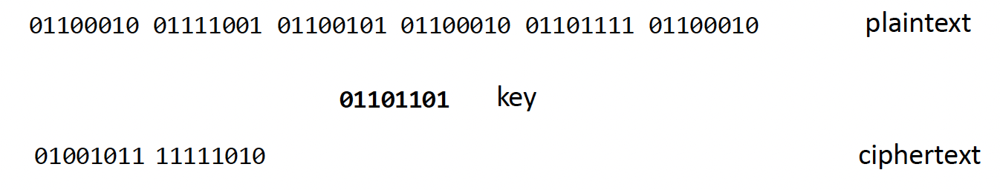
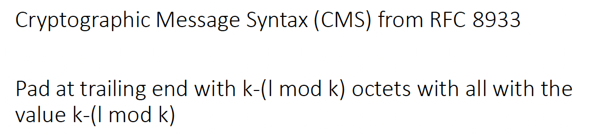

# Block Ciphers questions

## Introduction

&nbsp;

1. Describe the process when working with a block cipher

In a block cipher, we take a block of data and encrypt that or decrypt that before moving on to the next block.
 

&nbsp;

2. How does this contrast with stream ciphers

In a stream cipher, we take each bit per bit or each byte per byte, instead of looking at blocks

&nbsp;

3. What is a typical block size

In terms of block size, typically, we're looking at 128 to 256 bit

&nbsp;

4. Describe a basic example illustrating the operations which can be completed in a block cipher

For each block of data we:
1. Split in two
1. Switch halves 
1. Do XOR with key

## Padding

&nbsp;

1. What about the previous example is unlikely to occur in practice

The length of the message happened to be a multiple of the key length. That's very unlikely to be the case in real world applications.

&nbsp;

2. How do we get round this?

To get around this we look at a primitive (fundamental operation defined within cryptography) called padding. Padding is the process of expanding the length of a message to ensure that it's a multiple of the key. There are a range of different standards which can be used to achieve this.

&nbsp;

3. Descibe an example standard

A simple example standard based on the cryptographic message syntax is shown here. 

In this example, what we're doing is we're figuring out effectively what the remainder is upon division by the key size. So if we have, for example, a key size of 12 and a message of length 8, then we've got 4 bytes left over. So we need to pad that up by another 4 bytes. So what we do there is we replicate that number in bytes for four different bytes.

&nbsp;

4. What kind of attack is the above form of padding vulnerable to?

The above form of padding with a short message can potentially lead to a Bleichenbacher attack

