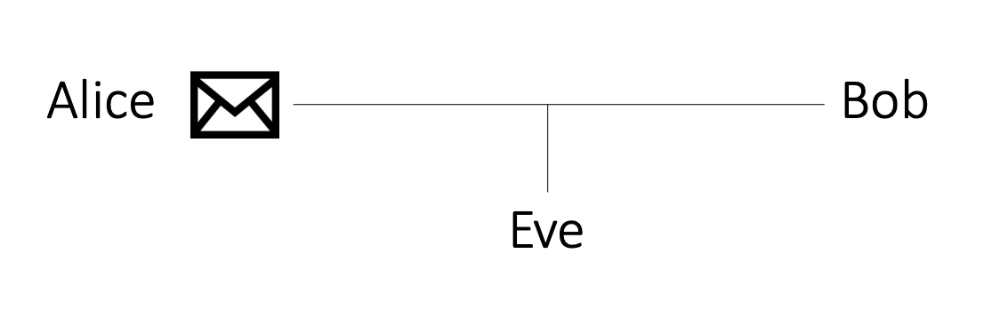
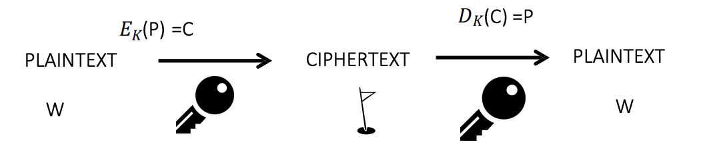

# Cryptography Overview questions

&nbsp;

1. Explain what a cipher is

A cipher is effectively an algorithm which allows us to send a message across an insecure network in a secure fashion. It means that if anyone were to intercept that message, they would be unable to read the contents of that message.

## Cryptography components

&nbsp;

1. State and describe the cryptographic components

* **Plain text:** The unencrypted message. This is a message that if anyone were to intercept that, they would be able to read it irrespective of whether they have access to the key or not
* **Key:** The key itself is the thing that allows us to apply the encryption. It's the
secret information that allows us to encrypt and potentially decrypt that information as well.
* **Ciphertext:** The bottom line here shows the ciphertext. Ciphertext is the result of applying encryption to the plain text using the key.

&nbsp;

2. What is the intention of a cryptographic message

* **Plain text:** The unencrypted message. This is a message that if anyone were to intercept that, they would be able to read it irrespective of whether they have access to the key or not
* **Key:** The key itself is the thing that allows us to apply the encryption. It's the
secret information that allows us to encrypt and potentially decrypt that information as well.
* **Ciphertext:** The bottom line here shows the ciphertext. Ciphertext is the result of applying encryption to the plain text using the key.

## Sending messages

&nbsp;

1. Describe a traditional crptographic set up when considering the sending of messages

Three of the key names that you might hear in relation to cryptography include Alice, Bob, and Eve. 

These are just traditional labels used to represent intended recipients, and the sender, as well as someone trying to intercept that message. So Alice is sending a message, Bob is receiving it or vice versa, and Eve is trying to intercept that message.

## Cryptographic Process

&nbsp;

1. Describe the cryptographic process

The overall process when it comes to ciphers is that we take our plaintext and we can apply our encryption algorithm using the key and that results in our ciphertext. And then we can perform the reverse, the decryption. We apply the decryption key to the ciphertext to get the plain text out.

The example that we have here, the key is basically a substitution where we're taking every letter in English alphabet and translating that into a little diagram or figure if you like. 

&nbsp;

2. State and describe the classifications cryptography can fall into

When we're looking at ciphers, there's two general classifications that you might come across:

* **Symmetric cryptography:** Within symmetric cryptography, we've got the same key for encryption as we do for decryption
* **Asymmetric cryptography:** Within asymmetric cryptography, we have a different key

