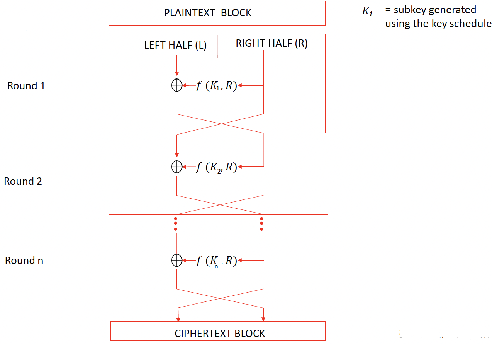

# Feistel Structures questions

&nbsp;

1. Draw a diagram of a Feistel structure

The below is referred to as a Feistel structure. This is a format which can be used within block ciphers and kind of gives you a blueprint for how a block cipher might operate.

## Encryption process

&nbsp;

1. Describe the encryption process

1. **Input:** Start with a plaintext block
    * Split the plaintext block into two halves: left half (L) and right half (R).
    * Assumption: Halves are even in size for simplicity (though uneven splits are possible).

1. **Initial Step:**
    * The right half (R) remains unchanged for the first round.
    * Apply a function to the right half using a round key (derived from the main key).
    * XOR the left half (L) with the result of the function: $L_{\text{new}} = L \oplus f(R, K_{\text{round}})$.
1. **Round Completion:**
    * Swap the new left half and the right half.
    * Proceed to the next round with a new round key.
1. **Repetition:**
    * Perform multiple rounds, each using a unique round key.
    * The number of rounds increases complexity, making reversal without the key more difficult.
1. **Final Flip:**
    * After completing all rounds, swap the halves one last time.
    * The result is the ciphertext block.
1. **Next Block:**
    * Process the next plaintext block similarly.

&nbsp;

2. What function is used

    
The function itself varies depending on the actual block cipher that you're using. So, for example, Twofish or DES, they have functions defined specifically for those, and they use the Feistel structure that we see here. 

## Decryption process

&nbsp;

1. Describe the decryption process

1. Decryption uses the same structure but reverses the order of the keys.
    * Start with the final round key (Key n) instead of the first round key.
    * Proceed backward through the rounds until all are completed.

1. Reason It Works:
    * The use of the XOR operation ensures reversibility:
        * XORing the encrypted data with the same function output recreates the original plaintext.
    * The structure ensures that decryption mirrors encryption regardless of the specific function used.

## Key points

&nbsp;

1. State the key points

* **Round Keys:** Derived from the main key; a unique round key is used in each round.
* **Function:** The specific function applied to the right half varies by cipher (e.g., DES, Twofish).
* **XOR Operation:** Core to the process, ensuring reversibility in decryption. 

