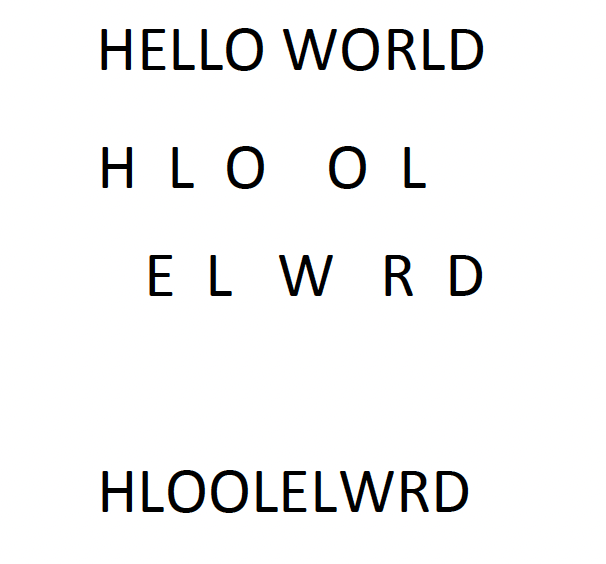

# Substitution Ciphers questions

## Caeser cipher

&nbsp;

1. Describe Caeser ciphers, using an example

A very simple cipher is where each letter is shifted along the alphabet. An example using a key of 3 is shown below:

A is shifted to D, B to E, and so on until we reach X which is then sent back to A.
 

&nbsp;

2. What is substitution. Describe with reference to the example above

* Substitution is simply a case of taking a letter or component within your plain text and substituting it with a different value. 
* In this instance, we're mapping letters to letters.
 

## Vigenere cipher

&nbsp;

1. Describe how a Vigenere cipher works

The Vigenere cipher makes use of the Caesar cipher except with the whole range of possible shifted values. So it starts off with a shift of 0, shift of 1, and goes further down until you get to the maximum shift of 25. Traditionally, this is done using a Vigenre cipher grid, as you can see here. 

Within the Vigenre cipher, we pick a key which doesn't have any repeated letters. And we then place that key above every letter within our plaintext. Repeat that key as needed over the plaintext. And we then use that to evaluate which alphabet we should be using in order to encrypt.  

&nbsp;

2. Work through an example

Say we use a keyword of ALICE and we want to encrypt the plaintext HELLO. Placing ALICE above HELLO we take the keyword value above each letter and look up our grid to get the correct ciphertext. Above H is A so we look up where row A intersect column H and we get H. Above E is L so we look up where the row L intersect the column E to obtain P. Repeating this process we finally obtain the ciphertext HPTNS.

&nbsp;

3. Describe another way of looking at the Vigenere cipher that is easier to code

Another way of looking at the Vigenre cipher is to translate every letter and into a position number. 

So A would be 0 through to 25. We can then translate any letter, whether that's in our plain text or whether that's in the key. And then, perform the addition for those. And the resulting value, obviously, it needs to be calculated mod 25. But the resulting output can then be translated back from a number into the corresponding letter. 

This is slightly easier if you ever want to implement this in code, for example. But often, that visual representation of the Vigenre square can be helpful in wrapping your head around what's happening. 

## Permutations

&nbsp;

1. What do permutations involve

Permutations, as the name suggests, is basically moving components around. 

&nbsp;

2. Describe an example

In the Rail-fence cipher we take every second letter and move it down to the line beneath that one. So if we look at hello world, on the top line, we end up with H, L, O, O, L. And then, the second line we've got E, L, W, R, D. 

The idea then is that you put the second line after the first line. So effectively, you end up with an anagram at the bottom there.

