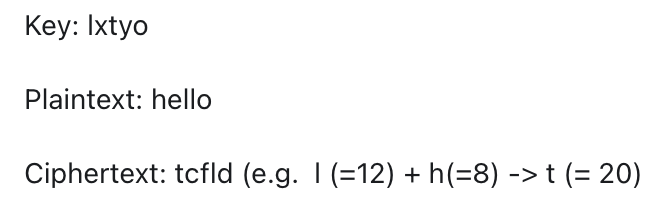

# Crptographic randomness and one-time pads - questions

## Randomness

&nbsp;

1. What does it mean for something to be truly random

* To be truly random means that there is no way to predict an event, such as a number series.
* This means that there are no discernible patterns.
 

&nbsp;

2. How is a random number selected

To identify a truly random number is to pick a number from a set, where each number is equally probable.
 

&nbsp;

3. What is used for randomness in cryptography

* In cryptography, pseudo-random numbers are used.
* Pseudo random number generators (PRNG) are algorithms which produce a series of numbers which appear random.
 

&nbsp;

4. What do PRNGs use to produce random numbers

&nbsp;
They make use of an initial seed value, a number which starts the generation of subsequent values. 
 

&nbsp;

5. In what circumstances should the seed be shared. Include an example

This seed should only be shared with those who require the ability to replicate the series, and where used in cryptography the seed is normally truly random. This is helpful in situations where you may be required to provide the sequence at another time. For example, PRNGs are used in simulation of viruses.
 

&nbsp;

6. What might PRNGs be referred to as when used in cryptography. Are there additonal re

Where PRNGs are used in cryptography you may see this as being referred to as Cryptographically Secure Pseudo Random Number Generators (CSPRNG). CSPRNGs have additional requirements which we won't discuss here but it is sufficient to note that they shoul be indistinguishable from true randomness.
 

&nbsp;

7. Are CSPRNGs different to PRNGs

CSPRNGs have additional requirements which we won't discuss here but it is sufficient to note that they shoul be indistinguishable from true randomness.
 

&nbsp;

8. Describe why CSPRNGs are useful

CSPRNGs can be sufficiently random to prevent attacks, but their deterministic nature means it can be used for encryption or other situation where you may be required to duplicate the values. It is also more efficient than trying to get a suitable list of truly random numbers.
 

## One Time Pad

&nbsp;

1. What is a one-time pad

A one-time pad is where a truly random key stream is used to encrypt the message. Each character (e.g. letter or bit or byte) is combined with a character from the key stream. 
 

&nbsp;

2. Describe an example

Consider a simple shift cipher where letters are shifted along by the key value in the corresponding position, looping back to the start of the alphabet. Assume the key provided below is truly random:

&nbsp;

3. What requirements must a key meet to be classified as a one-time pad

* it is truly random
* only two copies should exist - one for encryption, one for decryption
* it is one use only, and destroyed after use
* it is at least as long as the plaintext

&nbsp;

4. What is the key feature of one-time pads

Provided they are properly implemented, OTPs provide "perfect secrecy". No matter how much computational power you have, you can do no better than guessing randomly what the original message is.

&nbsp;

5. State some limitations of one-time pads

* there are the practical difficulties of efficiently obtaining a sufficiently long random key and sharing the key.
* with very short examples like that above, you would be able to guess all the possibilities fairly easily.

&nbsp;

6. What is the middle square method

The middle square method, which was developed by John Von Neumann in 1949, is the first pseudo random number generator, or PRNG.

&nbsp;

7. Describe the middle square method

The process is as follows:
* Takes the seed
* square it
* line it up in the middle
* extract the middle part

This gives the next values which can then be used to repeat the process. If the number doesn't have an even number of digits it can be padded. Eventually, the numbers will repeat but it could take a very long time.

&nbsp;

8. What is the period of a PRNG

The point at which numbers begin to repeat in a PRNG is called the period.

