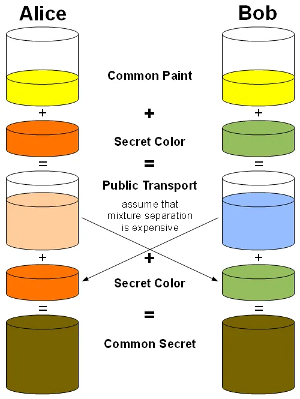
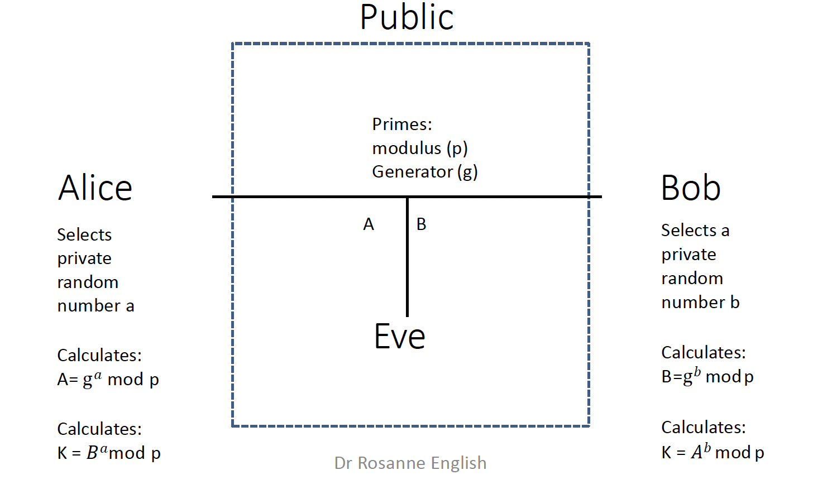

# Diffie-Hellman Key Exchange - questions

## Introduction

&nbsp;

1. What have we not yet looked at in the context of encryption and decryption

When looking at symmetric encryption and decryption, we've yet to answer a crucial question: How do both parties share a key in a secure manner? This could be done physically but often this won't be practical.
 

&nbsp;

2. What do we need

What we need is a key exchange algorithm.

## With colours

&nbsp;

1. Go through the Diffie-Hellman Key Exchange at a high level using colours

This process is summarised in the following:

* Alice and Bob each pick a private colour. At no point do either send these private colours over the public communication channel (Eve can't see).
* A public colour is agreed upon. Eve can access the public colour at any point, as can Alice and Bob.
* Both Alice and Bob combine the public colour with their own private colours. This results in private colours that can't be seperated into their component colours. Even though Eve has access to the public colour it is computationally infeasible to try an extract what Alice or Bob's private colours were.
* Alice and Bob share the colours consisting of their own private colour and the public colour with each other.
* Each then adds their own private colour to end up with their shared secret key consisting of
    * Alice's colour
    * Bob's colour
    * The public colour
* We need part of a secret to generate that final key but Eve is never going to be able to access either one of those from the information that she has available to her

## With mathematics

&nbsp;

1. Go through the Diffie-Hellman Key Exchange with numbers

* In terms of the publicly agreed information, we have two values:
    * A large prime key $p$. The larger it is the harder it is for an attacker to perform a brute-force attack or solve the discrete logarithm problem.
    * A number $g$, typically chosen such that it generate all the elements of the group $modulo$ $p$ except $0$.
* Alice and Bob define their own private integers, $a$ and $b$, which are less than $p$ and are never communicated across the public channel.
* Alice calculates $A = g^{a} \mod p$ and Bob calculates $B = g^{b}\mod p$ and communicate these over the insecure channel. Knowing $p$ and $g$, it is still computationally infeasible for Eve to be able to figure out be private integers $a$ and $b$.
* Alice and Bob can then calculate the shared key by raising $B$ to the power of $a$ and $A$ to the power of $b$ respectively:

$$B^{a} = (g^{b})^{a} \mod p = (g^{a})^{b} \mod = A^{b}$$

* Even though Eve has access to $A$, $B$, and $g$ she's unable to derive the final secret key and doesn't have access to $a$ or $b$.

