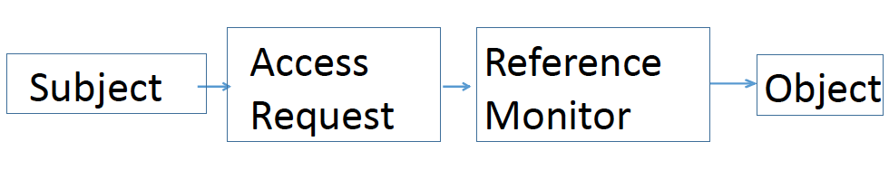
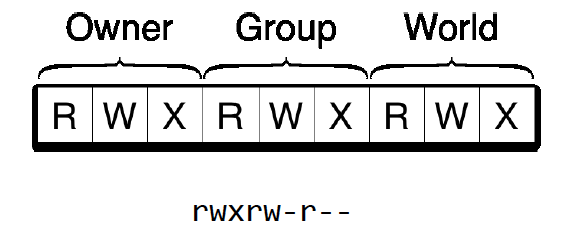

# Authorisation - questions

## Introduction

&nbsp;
<details>
<summary>
1. What are the stages when you try to access a system as an end user and which have we looked at
</summary>

* **Identification:** where you claim an identity
* **Authentication:** where you try to confirm an identity
* **Authorisation:** making sure you have the appropriate permissions and authority to access specific data or functions 

So far in our look at access control, we've looked at identification and authentication, but we haven't looked at authorization.

</details>

&nbsp;
<details>
<summary>
2. What is authorisation
</summary>

Authorization is the element that basically says, OK, you have access to the system, but are you permitted to complete this particular task? This could be access to particular files, or it could be access to a particular function within a system. 
</details>

&nbsp;
<details>
<summary>
3. What is access control in this context
</summary>

Access control can be considered as the way of managing the authorization element of this process.
</details>

## Access Control Models

### Lampson model

&nbsp;
<details>
<summary>
1. Describe the Lampson model
</summary>



You'll see on the diagram here we have four entities:
* **Subject:** an end user or even a process requesting access. 
* **Access Request:** which is the request itself to gain access to a particular resource.
* **Reference Monitor:** the part of the system which verifies if the subject has the correct authorization levels for that particular object.
* **Object:** resource being accessed (e.g. file or function)

</details>

&nbsp;
<details>
<summary>
2. Where could we attach the authorisation element
</summary>

We could attach the authorization element at the following:
* **Subject Level:** Defines what actions a subject is allowed to perform (e.g. Alice can read but not write)
* **Object Level:** Defines what actions are permitted for an object (e.g. users can read but not alter)
</details>

### Unix Access Control

&nbsp;
<details>
<summary>
1. At a basic level what are the access modes
</summary>

There are, at a basic level, two access modes - observe and alter. 
</details>

&nbsp;
<details>
<summary>
2. What are the operation within the Linux system
</summary>

Within this system, we have the operations:
* Read (`R`) 
* Write (`W`)
* Execute (`X`).  
</details>

&nbsp;
<details>
<summary>
3. What are the member categories within the Linux system
</summary>

We have the following categories:
* **Owner:** User who created the particular object
* **Group:** A defined group of users within the system.
* **World:** Any user outside the owner or group 
</details>

&nbsp;
<details>
<summary>
4. Give example permissions
</summary>

For each of the member categories we have permissions. For example:



* Full access for owner (fairly standard): ```R W X```
* Read and write but no execution for group: ```R W -```
* No one else to have any access: ```- - -```
</details>

## Principle of Least Privilege

&nbsp;
<details>
<summary>
1. Explain the principle
</summary>

* This effectively says that you should permit access at the least amount of privilege possible. 
* For example, to do their job, you should not give someone complete access to everything, but you should only give them access to the minimal amount of information that they need in order to execute their job properly. 
</details>

&nbsp;
<details>
<summary>
2. What are the reasons for using least privilege
</summary>

The reasons for using least privilege are:
* if someone were to be given more access than required, that, obviously, increases the chances of information disclosure
* it also increases the risk of an attacker trying to gain access to that particular account in order to increase their access to particular functions or objects. 
</details>

&nbsp;
<details>
<summary>
3. What is the latter referred to as
</summary>

a privilege escalation attack.
</details>

## Privilege Escalation Attacks

&nbsp;
<details>
<summary>
1. State the types of privilege escalation attack
</summary>

There are two different types of privilege escalation attack:
* vertical privilege escalation attack
* horizontal privilege escalation attack
</details>

### Vertical Privilege Escalation

&nbsp;
<details>
<summary>
1. What is a vertical privilege escalation attack
</summary>

A vertical privilege escalation attack is where the attacker tries to move onto an account which has more access than they have. 
</details>

&nbsp;
<details>
<summary>
2. Describe an example
</summary>

As an example, you could think of this as someone working with a university and trying to gain access to a user account for HR, which is going to have more access to the data relating to employee salaries.
</details>

### Horizontal Privilege Escalation

&nbsp;
<details>
<summary>
1. What is a horizontal privilege escalation attack
</summary>

A horizontal privilege escalation attack is where the attacker tries to gain access to users with the same level of functionaility but with different data. 
</details>

&nbsp;
<details>
<summary>
2. Describe an example
</summary>

For example, if you have an account for a bank, and you're trying to get access to someone else's account, clearly, that would violate the information security. But you would still be accessing the same level of functions.
</details>

### Delivery Mechanisms

&nbsp;
<details>
<summary>
1. How might privilege escalation attacks be delivered
</summary>

They can be delivered through, for example, password guessing attacks or SQL injection attacks.  
</details>