# Biometrics - questions

## Biometrics overview

&nbsp;

1. What is a biometric

A biometric is a sufficiently distinct trait which can be measured, quantified, and stored in such a way as to allow authentication to happen for the end user.

&nbsp;

2. What are the categories of biometrics

* **physical biometrics:** facial identification, fingerprint recognition, and so forth
* **behavioural biometrics:** things like how you type

&nbsp;

3. What are the stages of biometric authentication

Enrolment followed by operations

&nbsp;

4. Describe the Enrolment process

* When we look at enrolment, what we're trying to establish is what's referred to as a template. 
* A template is basically the computer representation of that distinctive trait. 
* So for example, a fingerprint could be broken down into aspects, such as the swirls and loops within your fingerprint. 
* Having this template stored means that when you go to authenticate, you provide your biometric, and it can take that, perform the similar calculation, and determine whether it's sufficiently close to the template.

&nbsp;

5. Describe the modes of operations

* **Verification:** 
    * this mode is very likely what you use most of the time. 
    * This is where there's a template stored, you've already claimed your identity, and you're just trying to check that the biometric you provide matches the identity template that they have on the database.
* **Identification:** 
    * In contrast, identification mode is more like what we would think of as a watch list for the FBI, where you're presented with a biometric and you need try and find the corresponding identity from the database. 
    * That's a much more challenging problem and not one that we are particularly interested in for this module. So, we'll focus on verification mode.

&nbsp;

6. What is a helpful tool to have when looking at different biometric systems

When looking at different biometric systems, one helpful tool is to be able to determine whether one is better than the other.

&nbsp;

7. What do we need to determine which biometric system is better when performing comparisons

In order to do this, we need to define a few metrics, which are going to be helpful. We have 
* **true positive (TP):** where someone is the genuine user and is accepted as they should be. 
* **true negative (TN):** where someone isn't a user and they are correctly rejected. 
* **false positive (FP):** where someone shouldn't be allowed access, but is allowed access. 
* **false negative (FN):** where someone should be accepted, but they have been rejected

The following are also needed:
* **true acceptance rate:** proportion of genuine users that are appropriately authenticated. Given by $\frac{TP}{TP+FN}$ 
* **true rejection rate:** proportion of unauthorised users that are appropriately rejected. Given by $\frac{TN}{TN+FP}$ 
* **false acceptance rate:** proportion of unauthorised users that a incorrectly authenticated. Given by $\frac{FP}{FP+TN}$
* **false rejection rate:** proportion of genuine users that are incorrectly rejected. Given by $\frac{FN}{FN+TP}$

&nbsp;

7. What should our aim be in any biometric system

Clearly, in any biometric system, we want to maximise the true positives and minimise the false negatives.

&nbsp;

8. How can we model this

* One way of modelling this information is to use an ROC curve. 
* This stands for Receiver Operating Characteristic. 
* Effectively, what this does is it maps our true acceptance rate (proportion of people who were accepted and should have been accepted) versus the false acceptance rate (proportion of people who were accepted, but shouldn't have been).

&nbsp;

9. Describe an example ROC curve and how it's formed

We can map the value for a given biometric classifier on this graph shown here.

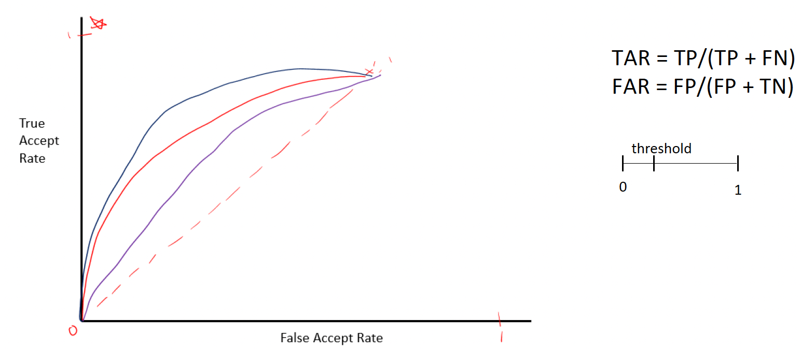

On the $x$-axis, we have the false acceptance rate. And on the $y$-axis, we have the true acceptance rate. 

At the corner, we have the value $0$, and our maximum is going to be $1$ on both of these as we are working with a proportion of the whole.

* On our ROC curve, if we were to take a particular biometric classifier or biometric system and plot the true accept rate and the false accept rate for all the different thresholds that we wish to look at, then we can make our ROC curve. 
* Now, if we were to do something and it was basically random guessing, what we would end up with is a diagonal line up here. Then for our curve, if we start off at 0, then we'll end up with something which looks a little bit like this, where that's going to end up as $(1,1)$. 
* This means that we can start to compare different systems because we can have curves with different shapes (see graph). 
* If you consider the three curves, which is the better system?. 
    * Well, the better system is the one that gives us a better true accept rate and a lower false accept rate. 
    * In this particular instance, the curve at the top is performing better. We're getting a higher true acceptance rate for not much of an increase along our false accept rate. 
    * Whereas, this bottom curve, there's not terribly much movement there. It started to become closer to guesswork. 

&nbsp;

10. Describe the process for evaluating biometric classifiers

When we look at our classifier effectively, what you're going to end up with is a score. 
* You're going to look at the biometric that's provided. 
* You're going to perform whatever transformations and calculations you need to complete, and then you need to make a judgement as to whether you accept that it matches the template or doesn't match the template. 
* Now, this is normally done on a sliding scale. 
* So on this sliding scale, we need to decide, at which point we'll say, OK, this is where we're going to accept that these two are similar enough in order to provide a positive result. 
* Now clearly, this threshold can be moved around:
    * You can say move this closer to zero. In which case, you're going to get more true positives because you're catching more people and saying that they're positive, but you are also going to increase your false positives because you're lowering that threshold for acceptance.
    * In contrast, if you were to move this higher up, then you would get certainly lower false positives, because you have a higher standard to meet. However, you would also get lower true positives. You'll start to reject people who should be accepted. So it is a bit of a balance trying to find out where on that scale we want to place our threshold.

## Further Biometrics

&nbsp;

1. What benefit to biometrics offer

* Biometrics offer the benefit of less cognitive load on the end user. 
* You don't need to remember a range of passwords or other knowledge-based authentication. 
* Instead, it's something which comes inherently with them, such as a fingerprint or an iris or retina scan.

### Physical Biometrics

#### Facial recognition

##### Modes of Operation

&nbsp;

1. Describe the modes of operations with biometrics

Recall that we have two possible uses or modes of operations with biometrics:

1. **Identification:** 
    * where you have a range of possible images and you're trying to identify an individual person within that.
    * commonly used in settings like security systems or public surveillance

1. **Verification:** 
    * which is what we are focusing on, where there's a stored biometric, perhaps in a device, and you're just trying to verify that the identity claimed matches the one stored. 
    * For example, this is used in mobile devices where a stored facial template is compared to a real-time image.

##### How it Works

&nbsp;

1. What features are looked at in facial recognition

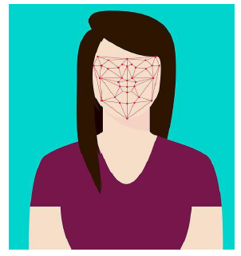

With facial recognition, we're commonly looking at features on the face. Examples include:
* distance between your eyes
* the length of your nose
* distance between the mouth and eyes
* a variety of different focus points on the face. 

&nbsp;

2. How are the features used

This can then be translated into a template when you are registering:

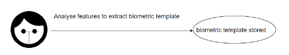

&nbsp;

3. What happens during authentication

When you go to authenticate, it tries to extract this information again from the visual that it has and sees whether it closely matches the template stored in your database:

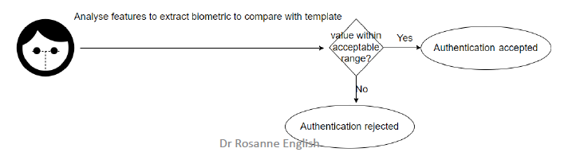

&nbsp;

4. Give an example of an algorithm used in facial recognition

There are a range of different options in terms of the algorithm used to implement this. One such algorithm is Eigenfaces. 

&nbsp;

5. How are different methods reviewed

The NIST does regular testing of a range of different mechanisms, looking at aspects such as how effective the false accept rates and false reject rates are, and so forth. 

##### Challenges and Concerns

&nbsp;

1. Describe some challenges and concerns with facial recognition

* **Bias in Training Data:** One interesting area of facial recognition is around the diversity of the faces used to train such systems and algorithms. There has been a lot of research done at MIT which demonstrated that facial recognition was inherently biased, particularly towards white males. 
* **Privacy Issues:** There is, obviously, the privacy issues
* **Real-World Limitations:**
    * Real-world world use of facial recognition can be a little bit patchy. 
    * In particular, you've probably seen a number of news reports related to the use of facial recognition in crime settings and how individuals can be falsely registered as criminals.

#### Iris recognition

&nbsp;

1. What is the iris

The iris is effectively the colour around your pupil.

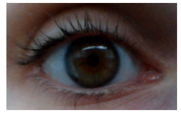

&nbsp;

2. How reliable is iris recognition 

* The patterns in the iris, if you look closely, are very unique. 
* So much so, the iris recognition is seen as one of the most reliable biometrics that you can use. 
* Even individuals who may be genetically linked, such as identical twins, are going to have sufficiently distinct iris patterns.

&nbsp;

3. Describe the enrolment process

For enrolment in iris recognition:
* a near infrared or infrared camera can be used to take an image of the eye. 
* The image is then examined with an algorithm to calculate coordinates for the pattern.
* A template is then formed. 

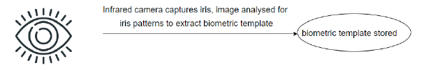

&nbsp;

3. Describe the verification process

At the time of verification:
* another image is taken. 
* The software is going to extract the features from that image and determine whether it meets the threshold when compared to the template.

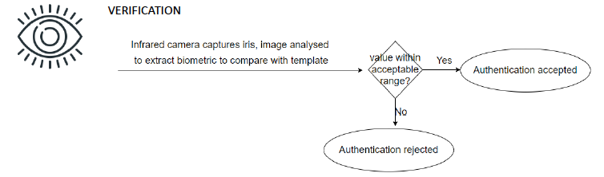

#### Retina recognition

&nbsp;

1. What is the retina

These are, effectively, the blood vessels at the very back of your eye, behind the lens.

&nbsp;

2. How can retinal scans be used

When light is shone onto the retina, they light up in a different kind of pattern, and so that information can be used to uniquely identify an end user. 

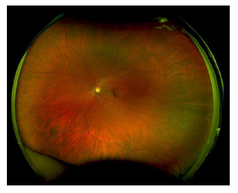

&nbsp;

3. Outline the enrolment process

The registration process is outlined here:

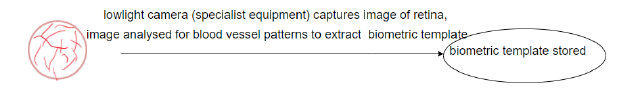

&nbsp;

4. Outline the verification process

The verification process is as follows:

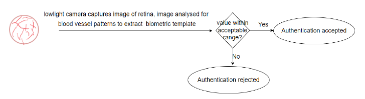

&nbsp;

5. Describe the advantages and disadvantages of retina recognitions

**Advantages:**
* This is often thought as the pinnacle of physical biometrics, it is highly accurate. 

**Disadvantages:**
* the retina can change with disease or age, so there's always the potential downfall of that changing. 
* retinal scanning is generally considered more invasive than iris recognition, and as a result, this means that the end user may be less likely to use it. 

&nbsp;

6. Describe a potential application

It can be used specifically in particularly high security situations where the cost of hardware and the invasiveness is not perceived as a particularly important constraint.

#### Fingerprint recognition

##### Fingerprint Patterns

&nbsp;

1. Describe the basic features you might see when looking at fingerprints

When you look at your fingerprint, you will notice 
* Ridges: Effectively, these are the lines on your finger.
* Valleys: this is the space between the ridges.

&nbsp;

2. Describe the basic patterns and minutiae

On screen here, you can see a number of different patterns which can be used in fingerprint recognition. 

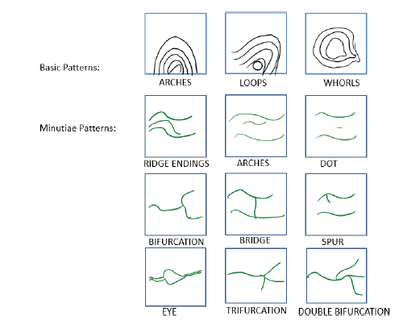

* **Basic Patterns:**
    * The top three basic patterns are what was traditionally used within fingerprint recognition. 
    * However, we've now progressed within the field and use what is referred to as minutiae patterns.
* **Minutiae Patterns:** 
    * Here, we have patterns such as 
        * **Ridge Endings:** where a line stops
        * **Arches:** Smooth, wave-like ridges that flow continuously without doubling back.
        * **Dots:** where there's a small ridge within two larger ridges 
        * **Bifurcations:** where a ridge splits into two 
        * **Bridges:** Short connecting ridges between two parallel ridges.
        * **Spurs:** A small ridge branching off from a longer ridge, resembling a hook or spur.
        * **Eyes:** An enclosed circular or oval-shaped ridge pattern.
        * **Trifurcations:** where a ridge splits into three
        * **Double Bifurications:** A point where a ridge splits into two branches, and then splits again into two.

&nbsp;

3. How are the minutiae used

* The new patterns provide much more complexity in terms of the detail. 
* This provides more features to be extracted for templates. 

##### Enrolment and Authentication Process

&nbsp;

1. Describe the enrolment process 

1. **Initial Scans:**

    * a number of images or scans of fingerprints are taken. 
    * in particular, the finger is rotated so that you get partials, as well as full coverage, in a range of different rotations.
    * this better helps it recognise you when you are trying to authenticate.
1. **Template Creation:**

    * these images are then analysed in order to determine the different patterns. 
    * This is digitised and stored as the template.

&nbsp;

2. Describe the authentication process 

1. **Scan Submission:**

    * When authenticating, the user presents their fingerprint and a scan is taken again.

1. **Comparison:**

    * The new scan is compared to the stored template.
    * A threshold of similarity is used to determine if the fingerprint matches the stored data.

##### Limitations and Challenges

&nbsp;

1. Describe limitations and challenges with fingerprint recognition 

1. **Physical Changes:** 

    * users can get cuts, or something like that, which might change your fingerprint.
    * For that reason, it's often recommended you input multiple fingerprints and have templates extracted from those. 

1. **Environmental Issues:** 

    * Wet fingerprints and/or wet sensors can fail to register a match, causing user frustration.

1. **Security Vulnerabilities:**

    * Fingerprints are fairly well known for being breakable. 
        * there's a famous piece of research where somebody took gummy bears, melted them down, and was able to create a phony fingerprint, which fooled the sensor. 
        * latent fingerprints from glasses or other surfaces may be lifted without the user's knowledge and then used to create fake fingers or little plastic bits that go over your finger for use.
    * Clearly, the hardware being used is going to impact how effective an attack might be.
    * Some biometric systems incorporate liveliness detection, where the sensors try to employ other techniques in order to detect whether it is a live person that is using that particular biometric.

### Behavioural biometrics

#### Introduction

&nbsp;

1. What are behavioural biometrics based on 

Behavioural biometrics are based on unique patterns of behavior rather than physical characteristics. 

&nbsp;

2. Give some examples

Examples come from keyboard dynamics:
* how you input text into a keyboard, 
* the amount of time that you tend to spend dwelling on one letter compared to another. 
* The time between those, referred to as the flight time, 

&nbsp;

3. How can behavioural biometrics be used

These can be sufficiently unique to identify individuals. 

#### Considerations in Biometric Authentication

&nbsp;

1. Describe things to consider when looking at biometric authentication

1. **Privacy Concerns:**
    * one of the most prevalent issues is the issue of privacy. 
    * As we develop more biometrics for multifactor authentication and for authentication in general, we start to realise that the kind of data that can be stored is becoming more and more valuable. 
    * As a result, people are often quite uncomfortable with the idea of these biometrics being taken from us and stored. 
1. **Failure to capture:**
    * This can be either in enrolment or in the verification stage. 
    * It's where the biometric is not successfully captured. 
    * Clearly, this is a usability issue and can cause issues for the end user.
1. **False Accepts and False Rejects:**
    * false accepts (unauthorized users incorrectly authenticated) and false rejects (Authorized users denied access) should be a low, 
    * trying to balance these against the usability and cost of the system can be a difficult challenge.
1. **Diversity in training data:**
    * use of machine learning within authentication, such as biometrics, can introduce concerns:
        * lack of diversity in training datasets
        * biases in algorithms leading to reduced accuracy for underrepresented groups 

