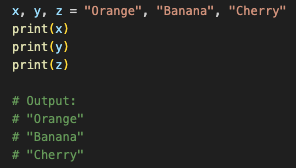
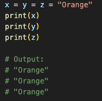
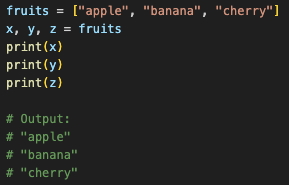

# Programming and variables

## Introduction

### Running a Python file

To run a python file from the terminal type *python3.11* followed by the name of the file. For example, to run 1.py:

```bash
python3.11 1.py
```

## Variables

Variables are containers for storing data values.

### Creating variables

In python, variables are created when you assign a value to it

```python
x = 5
y = "Hello, World"
```

Python has no command for declaring a variable. They don't need to be declared with any particular type and can even change type after they have been set.

```python
x = 4       # x is of type int
x = "Sally" # x is now of type str
```

### Casting

Python is an object-orientated language, and as such it uses classes to define data types, including its primitive types.

Casting in python is therefore done using constructor functions:

* ```int()``` - constructs an integer number from an integer literal, a float literal (by removing all decimals), or a string literal (providing the string represents a whole number)
* ```float()``` - constructs a float number from an integer literal, a float literal or a string literal (providing the string represents a float or an integer)
* ```str()``` - constructs a string from a wide variety of data types, including strings, integer literals and float literals

Integer examples:

```python
x = int(1)   # x will be 1
y = int(2.8) # y will be 2, as int() returns the integer part of a float
z = int("3") # z will be 3
```

Float examples:

```python
x = float(1)     # x will be 1.0
y = float(2.8)   # y will be 2.8
z = float("3")   # z will be 3.0
w = float("4.2") # w will be 4.2
```

String examples:

```python
x = str("s1") # x will be 's1'
y = str(2)    # y will be '2'
z = str(3.0)  # z will be '3.0'
```


### Type

You can get the data type of a variable with the type() function.

_example.png)

### Assigning Multiple Values

#### Many Values to Multiple Variables

Python allows you to assign values to multiple variables in one line:



#### One Value to Multiple Variables

And you can assign the same value to multiple variables in one line:



#### Unpack a Collection

If you have a collection of values in a list, tuple etc. Python allows you to extract the values into variables. This is called unpacking.



## Data Types

### Strings

### Booleans

## Basic containers

### Lists

#### Introduction


#### Accessing List Items

* Negative Indexing
* Range of Indexes
* Range of Negative Indexes

###### Check if Item Exists

The ```in``` keyword can be used to check if an item is in a list, returning ```True``` if it is and ```False``` otherwise.


#### Changing List Items

#### Adding List Items

#### Removing List Items

#### List Methods

* append()
    * Definition and Usage: appends an element to the end of a list
    * Syntax: ```list.append(elmnt)```, where ```elmnt``` can be of any type.
    * Example: 

        _example.png)

* clear()
    * Definition and Usage: removes all elements from a list
    * Syntax: ```list.clear()```
    * Example: 

        _example.png)

* copy()
    * Definition and Usage: returns a copy of the specified list
    * Syntax: ```list.copy()```
    * Example: 

        _example.png)

* count()
    * Definition and Usage: returns the number of elements with the specified value
    * Syntax: ```list.count(value)```
    * Parameter values: 
        * Required. 
        * Any type. 
        * The value to search for 
    * Example: 

        _example.png)

* extend()
    * Definition and Usage: adds the specified list element (or any iterable) to the end of the list
    * Syntax: ```list.extend(iterable)```
    * Parameter values: 
        * Required. 
        * Any iterable (list, set, tuple, etc.)
    * Examples: 
        * Add the elements of cars to fruits

        _example_1.png)

        * Add a tuple to the fruits list:

        _example_2.png)
        
* index()
    * Definition and Usage: returns the position of the *first* occurence of the specified value
    * Syntax: ```list.index(elmnt)```
    * Parameter values: 
        * Required. 
        * Any type (string, number, list, etc.)
        * The element to search for
    * Examples: 
        * What is the position of 'cherry'

        _example_1.png)

        * What is the position of 32 (first occurence)

        _example_2.png)

* insert()
    * Definition and Usage: inserts the specified value at the specified position
    * Syntax: ```list.insert(pos, elmnt)```
    * Parameter values:
        * ```pos```: 
            * Required. 
            * Number specifying in which position to insert the value
        * ```elmnt```: 
            * Required. 
            * Element of any type (string, number, object, etc.)
    * Example: 

     _example.png)   
        

* pop()
    * Definition and Usage: removes the element at the specified position
    * Syntax: ```list.pop(pos)```
    * Parameter values: 
        * Optional. 
        * A number specifying the position of the element you want to remove
        * Default value is -1, which removes the last item
    * Examples:
        * Remove the second element of the fruit list

        _example_1.png)

        * Return the removed element

        _example_2.png)

* remove()
    * Definition and Usage: removes the first occurence of the element with the specified value
    * Syntax: ```list.remove(elmt)```
    * Parameter values: 
        * Required. 
        * Any type
        * The element you want to remove
    * Example: 

    _example.png)

* reverse()
    * Definition and Usage: reverses the sorting order of the elements
    * Syntax: ```list.reverse()```
    * Parameter values: 
        * None
    * Example: 

    _example.png)

* sort()
    * Definition and Usage: sorts the list ascending by default. Can also make a function to decide the sorting criteria(s).
    * Syntax:
        * ```list.sort(reverse=True|False, key=myFunc)```
    * Parameter values:
        * ```reverse```: 
            * Optional. 
            * reverse=True will sort the list descending. Default is reverse=False
        * ```key```: 
            * Optional. 
            * A function to specify the sorting criteria(s)
    * Examples:
        * Sort list alphabetically

        _example_1.png)

        * Sort the list descending

        _example_2.png)

        * Sort the list by the length of the values

        _example_3.png)

        * Sort a list of dictionaries based on the "year" values

        _example_4.png)

        * Sort the list by the length of the values and reversed

        _example_5.png)

### Dictionaries

#### Dictionary Methods

* clear()
    * Definition and Usage: The clear() method removes all the elements from a dictionary.
    * Syntax: ```dictionary.clear()```
    * Parameter values: 
        * None
    * Example:

* copy()
    * Definition and Usage: returns a copy of the specified dictionary.
    * Syntax: ```dictionary.copy()```
    * Parameter values: 
        * None
    * Example:

* fromkeys()
    * Definition and Usage: The fromkeys() method returns a dictionary with the specified keys and the specified value.
    * Syntax: ```dict.fromkeys(keys, value)```
    * Parameter values:
        * ```keys```: 
            * Required.
            * An iterable specifying the keys of the new dictionary
        * ```value```: 
            * Optional.
            * Value for all keys. 
            * Default is `None`.
    * Examples:

* get()
    * Definition and Usage: returns the value of the item with the specified key. If the key does not exist, it returns the specified default value.
    * Syntax: ```dictionary.get(key, default)```
    * Parameter values:
        * ```key```: 
            * Required.
            * The keyname of the item you want to return the value from
        * ```default```: 
            * Optional.
            * A value to return if the specified key does not exist.
            * Default value ```None```
    * Examples:

* items()
    * Definition and Usage: returns a view object. The view object contains the key-value pairs of the dictionary, as tuples in a list. The view object will reflect any changes done to the dictionary.
    * Syntax: ```dictionary.items()```
    * Parameter values: 
        * None
    * Examples:


* keys()
    * Definition and Usage: rreturns a view object. The view object contains the keys of the dictionary, as a list. The view object will reflect any changes done to the dictionary, see example below.
    * Syntax: ```dictionary.keys()```
    * Parameter values: 
        * None
    * Examples:

* pop()
    * Definition and Usage: removes the specified item from the dictionary. The value of the removed item is the return value
    * Syntax: ```dictionary.pop(keyname, defaultvalue)```
    * Parameter values:
        * ```key```: 
            * Required.
            * The keyname of the item you want to remove
        * ```default```: 
            * Optional.
            * A value to return if the specified key do not exist.
            * If this parameter is not specified, and the no item with the specified key is found, an error is raised
    * Examples:

* popitem()
    * Definition and Usage: removes the last inserted key-value pair and returns it as a tuple. Raises `KeyError` if the dictionary is empty.
    * Syntax: ```dictionary.popitem()```
    * Parameter values: 
        * None
    * Examples:

* setdefault()
    * Definition and Usage: returns the value of the specified key. If the key does not exist, inserts it with a specified value.
    * Syntax: ```dict.setdefault(key, default)```
    * Parameter values:
        * ```key```: 
            * Required.
            * Key to search for or add if not found.
        * ```default```: 
            * Optional.
            * Value to set if the key is not found. Default is `None`.
    * Example:

* update()
    * Definition and Usage: updates the dictionary with the specified key-value pairs from another dictionary or iterable of key-value pairs.
    * Syntax: ```dict.update([other])```
    * Parameter values:
        * ```other```: 
            * Optional.
            * Dictionary or iterable containing key-value pairs to add to the dictionary.
    * Example:

* values()
    * Definition and Usage: returns a view object containing all values in the dictionary.
    * Parameter values: 
        * None
    * Syntax: ```dict.values()```
    * Example:

## Examples