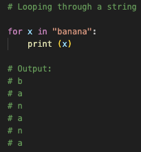
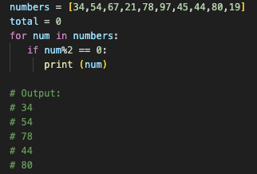
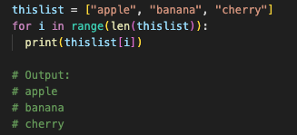
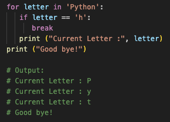
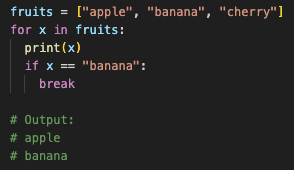
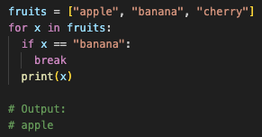

# Conditions and loops

## Logic conditions

## Loops

Python loops allow us to execute a statement or group of statements multiple times.

In general, statements are executed sequentially: The first statement in a function is executed first, followed by the second, and so on. There may be a situation when you need to execute a block of code several number of times.

The following diagram illustrates a loop statement:

***IMAGE OF LOOP STATEMENT***

We will look at the following types of loop:
* for loop
* while loop

and the following loop control statements
* continue statements
* break statements
* pass statements

### For loops

#### For loop with Strings

Strings are iterable objects so can be looped through:



#### For loop with Lists

Python's list object is also an indexed sequence, and hence you can iterate over its items using a for loop.

In the following example, the for loop traverses a list containing integers and prints only those which are divisible by 2.



You can also loop through the list items by referring to their index number. Use the range() and len() functions to create a suitable iterable.



#### For loop with Range objects

#### For loop with Dictionaries

### While loops

### Loop control statements

Loop control statements change execution from its normal sequence. When execution leaves a scope, all automatic objects that were created in that scope are destroyed.

Python supports continue, break and pass statements

#### Continue statements

Python ```continue``` statement is used to skip the execution of the program block and returns the control to the beginning of the current loop to start the next iteration. When encountered, the loop starts next iteration without executing the remaining statements in the current iteration.

The continue statement is just the opposite to that of break. It skips the remaining statements in the current loop and starts the next iteration.

##### Continue statement with for loop


#### Break statements

Python break statement is used to terminate the current loop and resumes execution at the next statement

The most common use for Python break statement is when some external condition is triggered requiring a sudden exit from a loop. The break statement can be used in both Python while and for loops.

##### Break statement with for loop

If we use break statement inside a for loop, it interrupts the normal flow of program and exits the loop before completing the iteration.

* Example 1:

    

* Example 2: exit the loop when ```x``` is "banana"

    

* Example 3: exit the loop when ```x``` is "banana", but before print

    