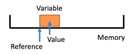
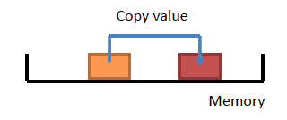
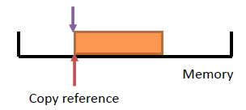

# Mutability and functions

## Mutability

In Python, a variable refers to a space in memory where a value is stored. Each variable is associated with a memory space, which has an address (similar to a street address for a house). The size of this memory space depends on the type of the variable (e.g., integer, float, list).

In the diagram below we have a space in memory and then we've defined a variable associated with this memory space



We can make an assignment using the assignment operator (```=```) and immutable and mutable variables will behave differently. 

### Immutable Variables

Immutable variables cannot be changed in place. When we make an assignment using with an immutable variable, a new memory space is created and the value is copied into this new space. As a result, the copied value can be updated without effecting the original.



```int```, ```float```, ```str```, ```bool```  and ```tuple``` are immutable types.

Consider the following example:

```python
y = 5    # y is an integer
x = y    # x gets a copy of y's value (new memory space)
y = 10   # Changing y doesn't affect x as it's stored in a seperate memory space 
```

1. Assignment of ```y = 5```:
    * ```y``` is assigned the integer value ```5```.
    * Since integers are immutable in Python, ```5``` is an object stored in a fixed memory space.
    * ```y``` holds a reference to this memory space where ```5``` is stored.

1. Assignment of ```x = y```:
    * When you write ```x = y```, you’re effectively saying, "make x point to the same memory location as ```y```."
    * At this point, ```x``` and ```y``` both refer to the same integer object (```5```) in memory, so no new memory is created for ```x```. They’re just pointing to the same immutable object (```5```).
1. Reassignment of ```y = 10```:
    * When ```y``` is reassigned to ```10```, Python doesn’t modify the integer ```5``` (because integers are immutable).
    * Instead, it creates a new integer object ```10``` in memory, and ```y``` now references this new memory location.
    * ```x``` still points to the original integer ```5``` in memory, while ```y``` now points to ```10```.
1. Result:
    * Since integers are immutable, assigning a new value to ```y``` (```y = 10```) does not affect ```x```. ```x``` still references the original value (```5```), and ```y``` now references the new value (```10```).

### Mutable Variables

Mutable variables can be changed in place. When we make an assignment using with a mutable variable, a reference to the original memory space is assigned. As a result, any change to the new variable affect the old variable, and vice-versa, as they share the same memory space.



They are used when we are working with a larger block of memory to avoid it being copied around our program all the time as this would require more CPU and memory usage and slow the program down.

However, care needs to be taken as we might end up updating a variable when we think we have created a seperate variable.

```list```, ```dict``` and ```objects``` (not all of them) are mutable types.

Consider the following example:

```python
values = [10]    # values is a list
p = values       # p is a reference to the same list
p[0] = 5         # Modifying p affects values as well
```

1. Assignment of ```values = [10]```:
    * values is assigned to a list containing a single element, ```[10]```.
    * Lists are mutable in Python, meaning their contents can be modified in place.
    * values holds a reference to a memory location where this list object (```[10]```) is stored.
1. Assignment of p = values:
    * When you write p = values, you’re assigning p to refer to the same memory location as values.
    * In other words, p does not get a separate copy of the list. Instead, p is just another reference (or alias) pointing to the same list object in memory.
    * At this point, both p and values are references to the same list ```[10]```.
1. Modification with p[0] = 5:
    * Since p and values refer to the same list, modifying the list through p affects the list that values also references.
    * p[0] = 5 changes the first element of the list from 10 to 5.
    * Because p and values point to the same list, this change is reflected in both p and values.
1. Result:
    * After the assignment p[0] = 5, both p and values reference the updated list [5].
    * Since lists are mutable, modifications to the list affect all references to that list.

### Copying

In Python, copying is essential when working with mutable objects (e.g., lists, dictionaries) to ensure that changes to one variable don’t affect another. Copying can be done in two main ways: shallow copy and deep copy.

#### Shallow Copy

* **Definition:** A shallow copy creates a new object but does not recursively copy objects within it. Only the "top layer" is copied, so if the original object contains nested mutable objects (like lists within lists), the nested objects are not copied. Instead, they are referenced.

* **Methods:**

    * Use ```.copy()```. Without a prefix it is not a standalone function in Python by default. However, if you’re working with certain objects (like lists or dictionaries), they may have their own ```.copy()``` method to create shallow copies.
    * Use ```copy.copy()``` from the ```copy``` module. This creates a shallow copy of an object

* **Example:**

```python
import copy

values = [10]        # Original list
p = values.copy()    # Shallow copy of values
p[0] = 5             # Modifying p does not affect values

# Result:
# p = [5]
# values = [10]
```


* **Explanation:** In the example, ```p``` is a separate list from values. Since the list only has one level, changing ```p``` does not affect values. However, if values contained nested lists, a shallow copy would still reference those nested lists rather than creating copies of them.

#### Deep Copy

* **Definition:** A deep copy creates a new object and recursively copies all objects within it. This means that all layers of nested objects are copied, resulting in a fully independent copy.

* **Methods:**

    * Use ```copy.deepcopy()``` from the copy module.

* **Example:**

```python
import copy

values = [[10]]            # Original list containing a nested list
p = copy.deepcopy(values)  # Deep copy of values
p[0][0] = 5                # Modifying p does not affect values

# Result:
# p = [[5]]
# values = [[10]]
```


* **Explanation:**  Here, ```p``` is a completely separate copy of values, including the inner list. Modifying the inner list in ```p``` does not affect values, as both the outer and inner layers are independently copied.

#### Practical Considerations

* **Performance:** Copying large blocks of memory (especially deep copies) can be resource-intensive. Avoid excessive copying in performance-critical sections of code.
* **Explicit Copying:** If you need a separate copy, be explicit by using .copy() or copy.deepcopy(), rather than relying on simple assignment (=), which only creates a reference to the original data.

## Functions

Functions are pieces of code that perform specific tasks and can consist of one or more lines.

They are used for the following reasons:
* factorise a program into smaller pieces making it easier to understand and test
* allows repeated use of a piece of code, perhaps in different parts of the program

They can have zero or more input parameters or arguments and they can return ```None`` or a value. When we pass something in to a function it's synonymous or equivalent to using the assignment operator. 

### Functions and immutable variables.

When immutable variables are used as input parameters, the value is copied into a new variable within the function. Therefore, any changes to this variable inside the function do not affect the original variable outside the function.

```python
def add(x, y):
    z = x + y
    return z

y = 10
x = 5
result = add(x, y)
print(result)   # Output: 15
print(x)        # x remains 5
print(y)        # y remains 10

```

If we return immutable variables from a function, the value is copied or assigned to the variable outside the function. Changing this value does not affect the original variable inside the function.

### Functions and mutable variables.

When mutable variables are used as input parameters, the function receives a reference to the same memory location. This means any updates to the variable inside the function also affect the variable outside the function.

```python
def fun(my_values):
    """
    A function to append a value to an input list.
    """
    my_values.append(7)


# Define an empty list.
values = []

# Call the function.
fun(values)

print(values) # Output : []
```

In this example, values is modified within ```fun```, and the change persists outside the function because ```my_values``` and values reference the same list in memory.

If we return mutable variables from a function, updates to this variable outside the function will reflect in the original data inside the function as well, as they both refer to the same memory location.


