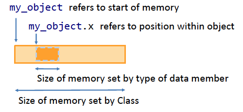

# Object-Oriented Programming (OOP) in Python

## Introduction

Object-Oriented Programming (OOP) is a programming paradigm based on the concept of objects. Objects are instances of classes, which serve as blueprints for creating objects. OOP allows for better organization of code by grouping data (attributes) and behavior (methods) into reusable components.

Key concepts introduced in this lecture:

1. **Classes and Objects:** Classes define the structure, while objects are instances of these classes.
1. **Constructors:** Special methods to initialize objects.
1. **Data Members:** Variables associated with objects.
1. **Inheritance:** Sharing functionality between related classes.

## Classes and Objects

### Defining a Class

In Python, a class is defined using the class keyword. The syntax is:

```python
class ClassName:
    def __init__(self, parameters):
        self.attribute = value
```

* **PascalCase** is used for naming classes (e.g., ```MyClass```).
* Use **snake_case** for variables and methods.

#### Example: A Simple Class

### The `__init__` Method (Constructor)

A constructor is a function which is called when you want an instance of a class. The ```__init__``` method in Python is used to initialize an object's state when it's created. Other programming languages use more conventional names for constructors, but Python uses ```__init__```. Another 'odd' thing about Python is that we can only define one constructor. If you want different inputs then what you can do is assign default values.

#### Usage of `self`

* The ```self``` keyword is a reference to the current instance of the class. It allows us to access the object’s attributes and methods within the class.
* ```self``` is required as the first parameter in any method that belongs to a class.

Example:
```python
class Person:
    def __init__(self, name, age):
        self.name = name
        self.age = age
```
When creating a ```Person``` object, ```self.name``` and ```self.age``` refer to attributes that belong to the specific instance of ```Person```.

### Attributes and Methods

* **Attributes:** Also known as data members, these are variables that belong to an object.
* **Methods:** Functions that belong to a class and act on the object’s attributes.

#### Example: Class with Data Member and Method
```python
class Car:
    def __init__(self, make, model):
        self.make = make
        self.model = model

    def description(self):
        return f"{self.make} {self.model}"
```

1. **Attributes:** ```make``` and ```model``` store information about the car’s brand and model.
2. **Method:** ```description()``` is a method that provides a description of the car.

### Objects and Data Members

When you create an object, a block of memory is allocated for it:

* **Object reference** points to the start of the memory block.
* **Data members** are offsets within the memory block, defined by their types.

Example:

```python
class MyClass:
    def __init__(self):
        self.x = 10  # Data member

my_object = MyClass()  # Create object
print(my_object.x)     # Access and print data member
```



### Member Functions

A class can also include member functions that operate on its data members.

Example:

```python
class MyClass:
    def __init__(self):
        self.name = "MyClass"

    def full_name(self):
        return self.name + " is an example"

m = MyClass()
m.name = "New name"
print("full_name = " + m.full_name())  # Output: New name is an example
```


### Data Classes

One type of class often used are Data Classes which hold mostly data with one or two member functions in there to return so-called transient values. E.g if given map coordinates you might have a function to return an angle.

Summary:
* Read/write to input/output
    * Often referred to as the "data model"
* Member functions to return transient data
    * Calculate simple features from stored values
    * e.g. angle from coordinates
* Limit functionality of member functions

### Algorithm Classes

The other type is algorithm classes

## Inheritance in OOP

### Concept of Inheritance

Inheritance allows a derived class or subclass to inherit the attributes and methods of a base class or superclass. This can avoid code duplication by reusing functionality from a base class.

### Superclass and Subclass

* **Superclass (Parent):** The class being inherited from.
* **Subclass (Child):** The class that inherits from the superclass.

#### The `super()` Function

The ```super()``` function allows us to call methods from the superclass in the subclass, commonly used to call the superclass's constructor.

Example:

```python
class Shape:
    def __init__(self):
        self.sides = 0

class Triangle(Shape):
    def __init__(self):
        super().__init__()
        self.sides = 3

triangle = Triangle()
print("Triangle has", triangle.sides, "sides")
```

## Practical Considerations

### Public and Private Members

### When Not to Use Classes

## Summary

## Single data member

Python in an OOP language and so everything in Python is an object, with its properties and methods. A Class is like an object constructor, or "blueprint" for creating objects.

Lets study the following example:

```python
class MyClass:
    def __init__(self,name):
        self.name = name
```

Notes:

* In the PEP 8 coding style, the class name should be in Pascal case meaning that the first letter of each compound word is capitalized
* To create a class, the keyword ```class``` is used followed immediately by the name of the class
* A function that's part of a class is called a method
* The method ```__init__()``` is special and is run automatically when a new instance of a class is created. It is used to assign values to object properties, or other operations that are necessary when the object is created. It is called the contructor. In Python we can only define one constructor per class
* The ```self``` variable is a reference to the current instance of the class and is used to access variables that belong to the class

Having defined a class we can create instances of the class:

```python
m1 = MyClass("A new object")
m2 = MyClass("A new object")
```

When calling the class name (```MyClass``` in the above example) as a function it calls the constructor. 

Now we have 2 objects we can work with the data member (```name``` in this case):

```python
m1.name = "Updated name"
print("m1.name = " + m1.name)
print("m2.name = " + m2.name)
```

So, we've changed the name of m1. The output of the prints is as follows:

```python
m1.name = Updated name
m2.name = A new object
```

We can use the name because, by default, data members and member functions are public