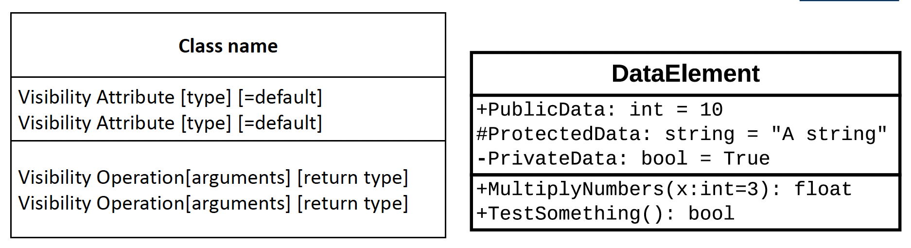
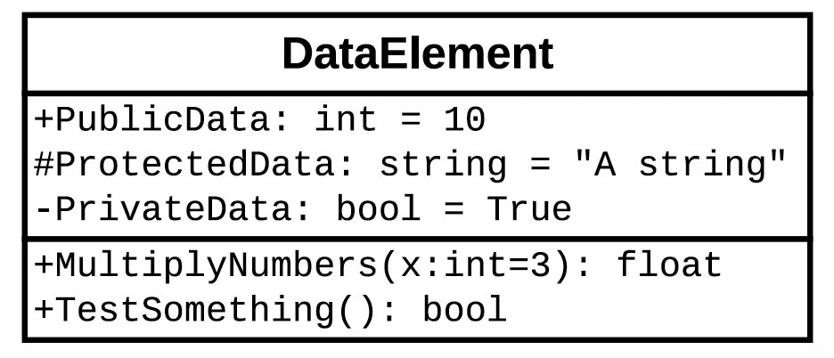
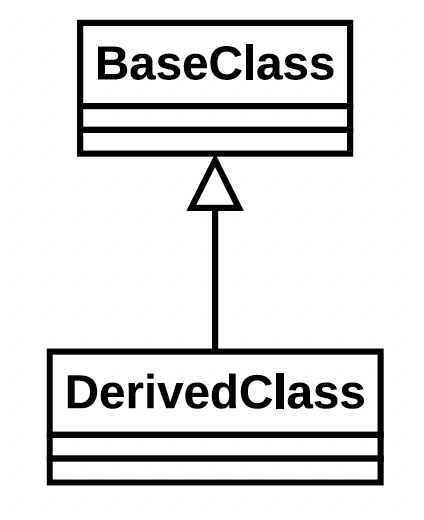
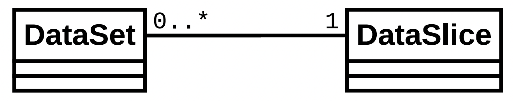
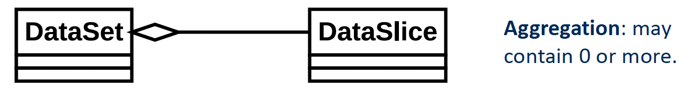
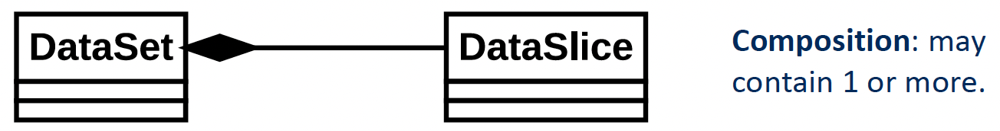

# Object-oriented design

## Introduction

This lecture builds upon last week's discussion on Object-Oriented Programming (OOP), focusing on advanced concepts like access control (public, private, and protected), operator overloading, and UML class diagrams.

## Review of Inheritance

Inheritance allows one class (subclass) to inherit the attributes and methods of another class (superclass).

In Python the super() function is used to call methods from the superclass. It is commonly used in constructors to initialize inherited attributes.

Example:
```python
class MapPosition:
    """
    A class to hold map position information.
    """
    def __init__(self):
        self.latitude = 0.
        self.longitude = 0.


class InclinedPosition(MapPosition):
    """
    A class to hold a map position and inclination.
    """
    def __init__(self):
        super().__init__()
        self.elevation = 0.


"""
A program to demonstrate inheritance of data members.
"""

# Create a position
m = MapPosition()
m.latitude = 13.0
m.longitude = -10.0

# Create an inclined position
p = InclinedPosition()
p.latitude = 55.860916
p.longitude = -4.251433
p.elevation = 16
```
## Public, Protected and Private

The ideas of Public, Protected and Private is important for inheritance.

* Public: Accessible from outside the class
* Protected: Acessible from a deived class, but not from outside the derived or base class. Only time you really want to use it is with inheritance.
* Private: Not accessible from outside the class. Useful if you want to encapsulate things in a class.

In Python underscores are used to set the access controls

Example: 

```python
class MyClass:
    """
    A simple class to demonstrate public, private and
    protected data members.
    """
    def __init__(self):
        self.name = "MyClass"
        self._protected_name = "Only derived know"
        self.__private_name = "Only this class knows"

    def public_function(self):
        return "This a public function"

    def _protected_function(self):
        return "This is a protected function"

    def __private_function(self):
        return "This is a private function"
```

## Accessor and Mutator Functions

You'll see these a lot in OOP. The idea is that you are providing access to data inside the object as you want to, meaning you can control how the data are changed.

* **Accessor (Getter):** Retrieves the values of a private/protected attribute
* **Mutator (Setter):** Modifies the value of a private/ protected attribute
 
```python
class MyClass:
    def __init__(self):
        self.__name = "MyClass"

    def get_name(self):
        return self.__name

    def set_name(self, name):
        self.__name = name

obj = MyClass()
obj.set_name("NewName")
print(obj.get_name())  # Output: NewName
```

In this example the Accessor and Mutator are both public but work on a private data member. If you remove the mutator you would effectively be giving users a read-only access which can be useful.

It is generally best to avoid getters and setters where possible in Python as they have a bit of a processing overhead. Instead you can use public data members to access them directly.

## Operator Overloading

Operator overloading allows developers to define how operator like ```+```, ```-```, ```==```, etc behave when applied to objects of a class. If you apply an operator to a user-defined class without implementing the operator it won't know what to do (other than the string operator)

One of the benefits of this is it can potentially improve the code structure. Instead of having to carry around bits of function calls to turn things into text strings or whatever, you cna put it into a class and then just use it wherever you want so it's potentially more readable.

They are all characterised by the pattern ```__name__```.

* ```__repr__```: String representation. More useful than ```__str__``` as it recursively applies the String operations
* ```__str__```: Readable string representation. Used more for debugging
* ```__eq__```: Equality comparison.
* ```__ne__```: Inequality comparison.
* ```__add__```: Add
* ```__sub__```: Subtract
* ```__mul__```: Multiply

### String representation

Here is an example illustrating the ```__repr__``` method to define how an object is represented as a string:

```python
class MyClass:
    """
    A simple class that contains a single data member.
    """
    def __init__(self, name):
        self.name = name

    def __repr__(self): 
        return f"MyClass(name=\"{self.name}\")" # Has to return a text string


"""
A program that demonstrates the conversion of an object
to a text string, using the repr function.
"""

# Create an object.
obj = MyClass("Some name")

# Print an object, which causes the object to be coverted
# to a string.
print(obj)
# Output: MyClass(name = "Some name")

# Use eval to run the text through the Python interpreter.
obj2 = eval(str(obj))
```

When print is called it implicitly calls ```__repr__``` to convert ```obj``` to a String before printing it. The output is ```MyClass(name = "Some name")```.

The ```str(obj)``` explicitly converts ```obj``` to a string using ```__repr__```. This results in the string ```"MyClass(name=\"Some name\")"```. ```eval()``` then compiles this string as if it were a Python expression, creating a new object seperate from the other one

### Comparisons

```python
class DataClass:
    def __init__(self, x):
        self.x = x

    def __eq__(self, other): # Has to have this form with another variable to receive the 'other' object
        return self.x == other.x # Can do this because 'other' should be of the same class even if 'x' is private

    def __ne__(self, other):
        return not self.__eq__(other)

d = DataClass(10)
p = DataClass(10)
print("d == p : " + str(d == p)) # d appears in the 'self', p in the 'other'
# Output d == p : True
print("d != p : " + str(d != p)) # d appears in the 'self', p in the 'other'
# Output d != p : False
```

## Object-oriented issues

OOP isn't always best.

* **Limited understanding at start of development:** If you have a problem you're working on it's common that you don't necessarily know everything when you start. This may lead to your first attempt being slightly wrong or even completely wrong. Incorrect encapsultaion may result in large changes being require, and be especially costly if inheritance is used.
* **State split between objects:** Objects have data. As they are passed around you're passing around functions and data inside that object. Bad code design can lead to data being copied all over the place. Not only is this inefficienta but can lead to data being out of sync in different parts of the program and bugs being harder to fix.

## UML

UML (Unified Modeling Language) is a standardized way to visualize and document the structure and relationships of classes.

### UML class diagrams

UML Class diagrams have several components:



1. **Class Name:** Top section of the box
1. **Attributes:** Middle section, lists data members and visibility indicators:
    * ```+``` for public
    * ```#``` for protected
    * ```-``` for private
1. **Methods:** Bottom section, lists member functions with visibility indicators.

### Example

Here is the Python code for a class `DataElement`:

```python
class DataElement:
    def __init__(self):
        self.public_data = 10
        self._protected_data = "Protected"
        self.__private_data = True

    def multiply_numbers(self, x=3):
        return x * self.public_data

    def test_something(self):
        return self.__private_data
```
Here is the corresponding UML diagram: 



### UML class relationships

Inheritance can be shown in UML as follows:



This shows that "derived class" inherits from "based class". You normally don't bother documenting the attributes of the base class again into the derived class.

### UML class association

We can also define associations between classes. In the following, ```DataSet``` is associated with zero or more ```DataSlice``` objects, and ```DataSlice``` is associated with exactly one ```DataSet```.



The following notation is also used:
* $0..^{*}$ - zero or more
* $1$ - exactly one
* $1..^{*}$ - one or more
* $0..1$ - zero or one

### UML class composition

An alternative to association is as follows:

* Aggregation: child object can meaningfully exist without the parent object, e.g. Class (parent) and Student (child). Delete the Class and the Students still exist.

    

* Composition: parent object owns another child class and that child class canno meaningfully exist without the parent class object, e.g. House (parent) and Room (child). Rooms don't exist seperate to a House

    